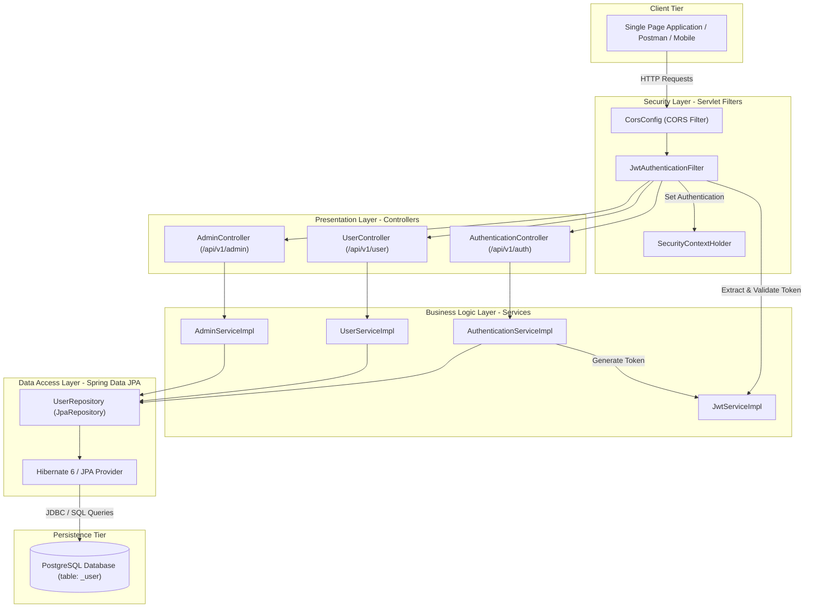
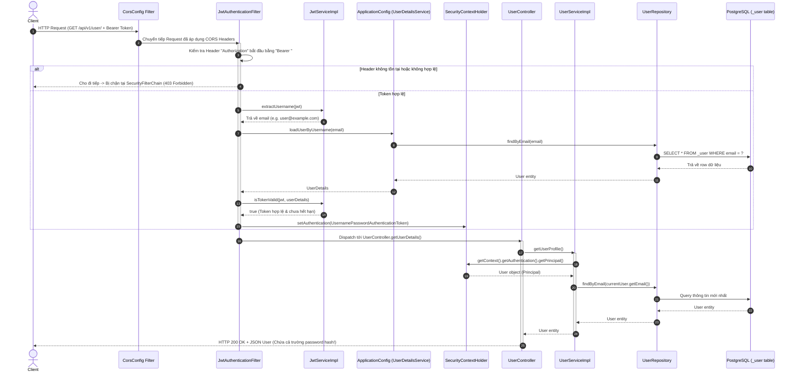

# BÁO CÁO PHÂN TÍCH TOÀN DIỆN MÃ NGUỒN (CODEBASE ANALYSIS REPORT)

**Repository:** `skill-management`  
**Remote Git:** `https://github.com/fur-elise-1867/skill-management.git`  
**Nhánh hiện tại:** `main` (Cam kết gốc: `b71259a Initial commit`)  
**Ngày phân tích:** 04/09/2026  
**Nền tảng kiểm thử & chạy:** Windows 10/11, Java 21 LTS (Oracle OpenJDK 21.0.8), Maven Wrapper (`mvnw.cmd`)

---

## 📌 TỔNG QUAN HIỆN TRẠNG (REALITY CHECK)

> [!WARNING]
> **Khoảng cách giữa Định danh Repository và Mã nguồn Thực tế:**  
> Repository mang tên **`skill-management`**, tuy nhiên toàn bộ mã nguồn hiện tại được sao chép/kế thừa từ dự án **`User-Management-JavaSpringBoot`** (tác giả gốc: Alwin Simon).
> 
> Hiện tại trong hệ thống **CHƯA CÓ BẤT KỲ MÔ HÌNH HOẶC API NÀO LIÊN QUAN ĐẾN KỸ NĂNG (SKILL MANAGEMENT)**. Dự án 100% là hệ thống **Quản lý người dùng, Xác thực & Phân quyền (Authentication & User Profile Management)** với Spring Security 6 và JWT.

---

## MỤC LỤC
1. [Phần A: Kiến trúc & Tô-pô Hệ thống (System Topology)](#phần-a-kiến-trúc--tô-pô-hệ-thống)
2. [Phần B: Cấu trúc Gói & Trách nhiệm Thành phần (Package Architecture)](#phần-b-cấu-trúc-gói--trách-nhiệm-thành-phần)
3. [Phần C: Vòng đời Thực thi & Luồng Xử lý Yêu cầu (Request Lifecycle)](#phần-c-vòng-đời-thực-thi--luồng-xử-lý-yêu-cầu)
4. [Phần D: Lưu trữ Dữ liệu & Mô hình Cơ sở Dữ liệu (Persistence & Schema)](#phần-d-lưu-trữ-dữ-liệu--mô-hình-cơ-sở-dữ-liệu)
5. [Phần E: Danh mục API & Đặc tả Giao tiếp (API Contracts)](#phần-e-danh-mục-api--đặc-tả-giao-tiếp)
6. [Phần F: Phân tích Bảo mật, Xác thực & Phân quyền (Security Deep-Dive)](#phần-f-phân-tích-bảo-mật-xác-thực--phân-quyền)
7. [Phần G: Hệ thống Build, Phụ thuộc & Môi trường (Build & Dependencies)](#phần-g-hệ-thống-build-phụ-thuộc--môi-trường)
8. [Phần H: Chiến lược Kiểm thử & Đảm bảo Chất lượng (Testing & QA)](#phần-h-chiến-lược-kiểm-thử--đảm-bảo-chất-lượng)
9. [Phần I: Lỗ hổng Bảo mật & Nợ Kỹ thuật Nghiêm trọng (Critical Defects & Debt)](#phần-i-lỗ-hổng-bảo-mật--nợ-kỹ-thuật-nghiêm-trọng)
10. [Phần J: Phạm vi Kiểm toán Tệp (Audit Boundary & Manifest)](#phần-j-phạm-vi-kiểm-toán-tệp)
11. [Phần K: Khuyến nghị Chiến lược & Lộ trình Phát triển (Recommendations)](#phần-k-khuyến-nghị-chiến-lược--lộ-trình-phát-triển)

---

## PHẦN A: KIẾN TRÚC & TÔ-PÔ HỆ THỐNG

Ứng dụng được xây dựng theo mô hình **Monolithic N-Tier Architecture (Kiến trúc phân tầng truyền thống)** dựa trên **Spring Boot 3.2.0** và **Spring Security 6**.



---

## PHẦN B: CẤU TRÚC GÓI & TRÁCH NHIỆM THÀNH PHẦN

Mã nguồn nằm trong package gốc: `com.alwinsimon.UserManagementJavaSpringBoot` tại thư mục [`src/main/java/com/alwinsimon/UserManagementJavaSpringBoot/`](file:///d:/Documents/Git%20Project/skill-management/src/main/java/com/alwinsimon/UserManagementJavaSpringBoot/).

### 1. Package: `Config`
Cấu hình ngữ cảnh Spring Context, Bean quản lý bảo mật và khóa ký.
- [`ApplicationConfig.java`](file:///d:/Documents/Git%20Project/skill-management/src/main/java/com/alwinsimon/UserManagementJavaSpringBoot/Config/ApplicationConfig.java): Định nghĩa các Bean hạ tầng: `UserDetailsService` (tải user từ `UserRepository`), `AuthenticationProvider` (`DaoAuthenticationProvider`), `AuthenticationManager`, `PasswordEncoder` (`BCryptPasswordEncoder`), và Bean động `currentUser` (lấy Principal từ `SecurityContextHolder`).
- [`Config/Auth/CorsConfig.java`](file:///d:/Documents/Git%20Project/skill-management/src/main/java/com/alwinsimon/UserManagementJavaSpringBoot/Config/Auth/CorsConfig.java): Cấu hình CORS Filter cho các endpoint `/api/v1/**`.
- [`Config/Auth/JwtAuthenticationFilter.java`](file:///d:/Documents/Git%20Project/skill-management/src/main/java/com/alwinsimon/UserManagementJavaSpringBoot/Config/Auth/JwtAuthenticationFilter.java): Bộ lọc kế thừa `OncePerRequestFilter`, chặn mọi request để bóc tách Bearer token từ header `Authorization`, thẩm định JWT và thiết lập `UsernamePasswordAuthenticationToken` vào `SecurityContext`.
- [`Config/Auth/SecurityConfig.java`](file:///d:/Documents/Git%20Project/skill-management/src/main/java/com/alwinsimon/UserManagementJavaSpringBoot/Config/Auth/SecurityConfig.java): Cấu hình `SecurityFilterChain` của Spring Security 6. Khai báo Stateless Session, tắt CSRF, phân quyền truy cập URL: `/api/v1/auth/**` (PermitAll), `/api/v1/admin/**` (HasRole ADMIN), `/api/v1/user/**` (HasAnyRole USER, ADMIN).
- [`Config/Bean/JwtKeyBean.java`](file:///d:/Documents/Git%20Project/skill-management/src/main/java/com/alwinsimon/UserManagementJavaSpringBoot/Config/Bean/JwtKeyBean.java): Lớp phụ trợ chứa Base64 Secret Key (`3254355385638293273920387473839202937484929274859492958492028247`).

### 2. Package: `Controller`
Điểm tiếp nhận yêu cầu RESTful API và điều hướng HTTP.
- [`AuthenticationController.java`](file:///d:/Documents/Git%20Project/skill-management/src/main/java/com/alwinsimon/UserManagementJavaSpringBoot/Controller/AuthenticationController.java): Cung cấp các endpoint công khai: `POST /api/v1/auth/register` và `POST /api/v1/auth/authenticate`.
- [`UserController.java`](file:///d:/Documents/Git%20Project/skill-management/src/main/java/com/alwinsimon/UserManagementJavaSpringBoot/Controller/UserController.java): Cung cấp endpoint cho người dùng cá nhân: `GET /api/v1/user/` (lấy thông tin profile) và `PUT /api/v1/user/update-details` (cập nhật thông tin profile).
- [`AdminController.java`](file:///d:/Documents/Git%20Project/skill-management/src/main/java/com/alwinsimon/UserManagementJavaSpringBoot/Controller/AdminController.java): Quản trị viên hệ thống: `GET /api/v1/admin/` (lấy danh sách toàn bộ người dùng), `GET /api/v1/admin/{email}` (lấy user theo email), `PUT /api/v1/admin/update-details` (sửa thông tin user), `DELETE /api/v1/admin/delete-user/{email}` (xóa user).

### 3. Package: `Model`
Định nghĩa thực thể cơ sở dữ liệu và các đối tượng truyền dữ liệu (DTO).
- [`Model/Entity/User.java`](file:///d:/Documents/Git%20Project/skill-management/src/main/java/com/alwinsimon/UserManagementJavaSpringBoot/Model/Entity/User.java): Thực thể JPA ánh xạ bảng `_user`, triển khai interface `UserDetails` của Spring Security. Chứa các trường: `id`, `name`, `email`, `gender`, `mobile`, `password`, `role`.
- [`Model/Entity/Role.java`](file:///d:/Documents/Git%20Project/skill-management/src/main/java/com/alwinsimon/UserManagementJavaSpringBoot/Model/Entity/Role.java): Enum phân quyền: `USER`, `ADMIN`.
- [`Model/Dto/RegisterRequest.java`](file:///d:/Documents/Git%20Project/skill-management/src/main/java/com/alwinsimon/UserManagementJavaSpringBoot/Model/Dto/RegisterRequest.java): DTO payload đăng ký tài khoản.
- [`Model/Dto/AuthenticationRequest.java`](file:///d:/Documents/Git%20Project/skill-management/src/main/java/com/alwinsimon/UserManagementJavaSpringBoot/Model/Dto/AuthenticationRequest.java): DTO payload đăng nhập (email, password).
- [`Model/Dto/AuthenticationResponse.java`](file:///d:/Documents/Git%20Project/skill-management/src/main/java/com/alwinsimon/UserManagementJavaSpringBoot/Model/Dto/AuthenticationResponse.java): DTO phản hồi trả về JWT token.
- [`Model/Dto/UserUpdateRequest.java`](file:///d:/Documents/Git%20Project/skill-management/src/main/java/com/alwinsimon/UserManagementJavaSpringBoot/Model/Dto/UserUpdateRequest.java): DTO cập nhật profile.

### 4. Package: `Repository`
Giao tiếp tầng dữ liệu.
- [`Repository/UserRepository.java`](file:///d:/Documents/Git%20Project/skill-management/src/main/java/com/alwinsimon/UserManagementJavaSpringBoot/Repository/UserRepository.java): Kế thừa `JpaRepository<User, Long>`, định nghĩa method truy vấn tự sinh: `Optional<User> findByEmail(String email)`.

### 5. Package: `Service` & `Service/Implementation`
Tầng xử lý nghiệp vụ.
- [`AuthenticationService.java`](file:///d:/Documents/Git%20Project/skill-management/src/main/java/com/alwinsimon/UserManagementJavaSpringBoot/Service/AuthenticationService.java) / [`AuthenticationServiceImplementation.java`](file:///d:/Documents/Git%20Project/skill-management/src/main/java/com/alwinsimon/UserManagementJavaSpringBoot/Service/Implementation/AuthenticationServiceImplementation.java): Thực thi đăng ký (mã hóa BCrypt, gán mặc định ROLE_USER) và xác thực (ủy quyền qua `AuthenticationManager`, sinh token JWT).
- [`JwtService.java`](file:///d:/Documents/Git%20Project/skill-management/src/main/java/com/alwinsimon/UserManagementJavaSpringBoot/Service/JwtService.java) / [`JwtServiceImplementation.java`](file:///d:/Documents/Git%20Project/skill-management/src/main/java/com/alwinsimon/UserManagementJavaSpringBoot/Service/Implementation/JwtServiceImplementation.java): Tạo, giải mã, trích xuất Claims (subject email) và kiểm tra hạn sử dụng của JWT token (HMAC-SHA256, thời hạn 24 giờ).
- [`UserService.java`](file:///d:/Documents/Git%20Project/skill-management/src/main/java/com/alwinsimon/UserManagementJavaSpringBoot/Service/UserService.java) / [`UserServiceImplementation.java`](file:///d:/Documents/Git%20Project/skill-management/src/main/java/com/alwinsimon/UserManagementJavaSpringBoot/Service/Implementation/UserServiceImplementation.java): Lấy profile của user đang đăng nhập và cập nhật dữ liệu cá nhân.
- [`AdminService.java`](file:///d:/Documents/Git%20Project/skill-management/src/main/java/com/alwinsimon/UserManagementJavaSpringBoot/Service/AdminService.java) / [`AdminServiceImplementation.java`](file:///d:/Documents/Git%20Project/skill-management/src/main/java/com/alwinsimon/UserManagementJavaSpringBoot/Service/Implementation/AdminServiceImplementation.java): Thực hiện CRUD quản trị trên toàn bộ tài khoản người dùng.

---

## PHẦN C: VÒNG ĐỜI THỰC THI & LUỒNG XỬ LÝ YÊU CẦU



---

## PHẦN D: LƯU TRỮ DỮ LIỆU & MÔ HÌNH CƠ SỞ DỮ LIỆU

### 1. Cấu hình Kết nối Cơ sở Dữ liệu
Trong [`src/main/resources/application.properties`](file:///d:/Documents/Git%20Project/skill-management/src/main/resources/application.properties):
- **DBMS:** PostgreSQL
- **JDBC URL:** `jdbc:postgresql://localhost:5432/user_management_db`
- **Username / Password:** `postgres` / `postgres` (Lưu dưới dạng văn bản thuần - plain text)
- **Hibernate DDL Auto:** `update` (Tự động cập nhật schema bảng khi entity thay đổi)
- **Driver:** `org.postgresql.Driver`

### 2. Mô hình Thực thể Bảng (`_user`)
Thực thể duy nhất trong hệ thống hiện tại là [`User.java`](file:///d:/Documents/Git%20Project/skill-management/src/main/java/com/alwinsimon/UserManagementJavaSpringBoot/Model/Entity/User.java#L21):

| Tên Cột | Kiểu Dữ Liệu SQL | Khóa / Ràng buộc | Mô tả |
| :--- | :--- | :--- | :--- |
| `id` | `BIGINT` | PRIMARY KEY, Generated Sequence | Định danh duy nhất của người dùng |
| `name` | `VARCHAR(255)` | NULL | Họ và tên người dùng |
| `email` | `VARCHAR(255)` | UNIQUE, NOT NULL | Địa chỉ email đăng nhập |
| `gender` | `VARCHAR(255)` | NULL | Giới tính người dùng |
| `mobile` | `VARCHAR(255)` | NULL | Số điện thoại liên hệ |
| `password` | `VARCHAR(255)` | NOT NULL | Mật khẩu băm (BCrypt hash) |
| `role` | `VARCHAR(255)` | Enum (`USER`, `ADMIN`) | Vai trò phân quyền (Lưu dưới dạng String) |

---

## PHẦN E: DANH MỤC API & ĐẶC TẢ GIAO TIẾP

Tất cả các endpoint phục vụ tại base URL: `http://localhost:8080`

| HTTP Method | URI | Quyền Truy Cập (RBAC) | Payload Đầu Vào (Request Body) | Dữ Liệu Trả Về (Response Body) |
| :--- | :--- | :--- | :--- | :--- |
| **POST** | `/api/v1/auth/register` | Public (PermitAll) | `RegisterRequest` `{name, email, gender, mobile, password}` | `AuthenticationResponse` `{"token": "<jwt>"}` (HTTP 201 Created) |
| **POST** | `/api/v1/auth/authenticate` | Public (PermitAll) | `AuthenticationRequest` `{email, password}` | `AuthenticationResponse` `{"token": "<jwt>"}` (HTTP 200 OK) |
| **GET** | `/api/v1/user/` | `ROLE_USER`, `ROLE_ADMIN` | Không (Header: `Authorization: Bearer <jwt>`) | `User` object (Bao gồm cả hash password) (HTTP 200 OK) |
| **PUT** | `/api/v1/user/update-details` | `ROLE_USER`, `ROLE_ADMIN` | `UserUpdateRequest` `{name, gender, mobile}` | `User` object sau cập nhật (HTTP 200 OK) |
| **GET** | `/api/v1/admin/` | `ROLE_ADMIN` | Không (Header: `Authorization: Bearer <jwt>`) | Danh sách `List<User>` toàn hệ thống (HTTP 200 OK) |
| **GET** | `/api/v1/admin/{email}` | `ROLE_ADMIN` | Path variable `{email}` | `User` object tương ứng (HTTP 200 OK) |
| **PUT** | `/api/v1/admin/update-details`| `ROLE_ADMIN` | `UserUpdateRequest` (Gồm cả email chỉ định) | `User` object sau cập nhật (HTTP 200 OK) |
| **DELETE**| `/api/v1/admin/delete-user/{email}`| `ROLE_ADMIN`| Path variable `{email}` | Chuỗi thông báo `"User deleted successfully"` (HTTP 200 OK) |

---

## PHẦN F: PHÂN TÍCH BẢO MẬT, XÁC THỰC & PHÂN QUYỀN

### 1. Cơ chế Xác thực (Authentication)
- Sử dụng **Stateless Session (`SessionCreationPolicy.STATELESS`)**.
- Quá trình đăng nhập sử dụng `AuthenticationManager` với `DaoAuthenticationProvider` và `BCryptPasswordEncoder`.
- Chuỗi JWT được ký bằng thuật toán HMAC-SHA256 (`SignatureAlgorithm.HS256`) với khóa bí mật kích thước 256-bit đặt trong [`JwtKeyBean`](file:///d:/Documents/Git%20Project/skill-management/src/main/java/com/alwinsimon/UserManagementJavaSpringBoot/Config/Bean/JwtKeyBean.java#L11). Thời gian sống của token được ấn định cứng là `24 * 60 * 60 * 1000` ms (24 giờ).

### 2. Cơ chế Phân quyền (Authorization & RBAC)
Trong [`SecurityConfig.java`](file:///d:/Documents/Git%20Project/skill-management/src/main/java/com/alwinsimon/UserManagementJavaSpringBoot/Config/Auth/SecurityConfig.java#L35-L42):
- Phương thức `getAuthorities()` trong thực thể [`User.java`](file:///d:/Documents/Git%20Project/skill-management/src/main/java/com/alwinsimon/UserManagementJavaSpringBoot/Model/Entity/User.java#L47) trả về `List.of(new SimpleGrantedAuthority(role.name()))`.
- Lưu ý: Spring Security quy ước phương thức `hasRole("ADMIN")` sẽ tự động tìm kiếm Authority có tiền tố `ROLE_ADMIN`. Nhưng trong `User.java`, `role.name()` chỉ trả về `USER` hoặc `ADMIN` (không có prefix `ROLE_`). Trong cấu hình `SecurityConfig.java`:
  - `hasRole(Role.ADMIN.name())` kiểm tra authority `ROLE_ADMIN`.
  - `hasAnyRole(Role.USER.name(), Role.ADMIN.name())` kiểm tra authority `ROLE_USER` hoặc `ROLE_ADMIN`.
  - **Hệ quả:** Có nguy cơ người dùng bị từ chối truy cập 403 Forbidden trừ khi Spring Security tự chuẩn hóa hoặc role được thêm tiền tố `ROLE_`.

---

## PHẦN G: HỆ THỐNG BUILD, PHỤ THUỘC & MÔI TRƯỜNG

### 1. Build Manifest & Dependencies ([`pom.xml`](file:///d:/Documents/Git%20Project/skill-management/pom.xml))
- **Build Tool:** Apache Maven (có sẵn `./mvnw` và `./mvnw.cmd`, Maven Wrapper 3.2.0).
- **Spring Boot Version:** `3.2.0` (phát hành tháng 11/2023).
- **Java Target Version:** Java 17 (`<java.version>17</java.version>`).
- **Thư viện chính:**
  - `spring-boot-starter-web`: Xây dựng RESTful web services.
  - `spring-boot-starter-security`: Spring Security 6.
  - `spring-boot-starter-data-jpa`: Tầng lưu trữ Hibernate ORM & JPA.
  - `postgresql` (`org.postgresql:postgresql`): Driver kết nối PostgreSQL.
  - `jjwt-api`, `jjwt-impl`, `jjwt-jackson` (`io.jsonwebtoken:jjwt-*` phiên bản `0.11.5`): Xử lý JSON Web Token.
  - `lombok` (`org.projectlombok:lombok`): Tự động sinh getter, setter, constructor, builder qua annotation processor.
  - `spring-boot-starter-test`: JUnit 5 Jupiter, Mockito, AssertJ.

### 2. Môi trường Thực thi Máy chủ
- Máy chạy hệ điều hành Windows.
- Phiên bản Java thực tế cài đặt trên máy: `Java 21 LTS` (`C:\Program Files\Java\jdk-21`).
- Môi trường không có biến môi trường toàn cục `JAVA_HOME` và không có lệnh `mvn` trên PATH (cần chỉ định đường dẫn JDK khi chạy `mvnw.cmd`).

---

## PHẦN H: CHIẾN LƯỢC KIỂM THỬ & ĐẢM BẢO CHẤT LƯỢNG

Hệ thống hiện tại có **DUY NHẤT 1 file test** tại [`src/test/java/com/alwinsimon/SpringBootExp1/UserManagementJavaSpringBootApplicationTests.java`](file:///d:/Documents/Git%20Project/skill-management/src/test/java/com/alwinsimon/SpringBootExp1/UserManagementJavaSpringBootApplicationTests.java).

### ❌ Khiếm khuyết chí mạng của bộ test:
1. **Sai lệch Tên Package:**  
   File test khai báo package là:  
   `package com.alwinsimon.SpringBootExp1;`  
   Trong khi toàn bộ mã nguồn chính nằm ở:  
   `package com.alwinsimon.UserManagementJavaSpringBoot;`
2. **Không thể chạy được `@SpringBootTest`:**  
   Khi khởi chạy kiểm thử, Spring Boot sẽ quét từ package của class test (`com.alwinsimon.SpringBootExp1`) trở xuống và **không tìm thấy `@SpringBootApplication`**, dẫn đến lỗi `IllegalStateException: Unable to find a @SpringBootConfiguration`.
3. **Thiếu vắng kiểm thử:**  
   Hệ thống có **0 kiểm thử đơn vị (Unit Test)** và **0 kiểm thử tích hợp (Integration Test)** cho Controller, Service, Repository hoặc Filter.

---

## PHẦN I: LỖ HỔNG BẢO MẬT & NỢ KỸ THUẬT NGHIÊM TRỌNG

Dưới đây là danh sách chi tiết các lỗi cần được khắc phục trước khi triển khai bất kỳ tính năng mới nào:

### 1. Lỗi Xung đột Cấu hình CORS (Runtime CORS Exception)
- **Vị trí:** [`CorsConfig.java` (dòng 19-21)](file:///d:/Documents/Git%20Project/skill-management/src/main/java/com/alwinsimon/UserManagementJavaSpringBoot/Config/Auth/CorsConfig.java#L19-L21)
- **Chi tiết:** Cấu hình đồng thời `config.addAllowedOrigin("*")` và `config.setAllowCredentials(true)`.
- **Hậu quả:** Theo đặc tả W3C và Spring Framework, khi `allowCredentials` là `true`, `allowedOrigins` không thể chứa ký tự đại diện `*`. Trình duyệt web (Chrome, Firefox) sẽ chặn toàn bộ response và ném lỗi bảo mật CORS phía client.

### 2. Rò rỉ Hash Mật khẩu Người dùng trong DTO Phản hồi (Information Disclosure)
- **Vị trí:** [`UserController.java` (dòng 26)](file:///d:/Documents/Git%20Project/skill-management/src/main/java/com/alwinsimon/UserManagementJavaSpringBoot/Controller/UserController.java#L26), [`AdminController.java` (dòng 27, dòng 33)](file:///d:/Documents/Git%20Project/skill-management/src/main/java/com/alwinsimon/UserManagementJavaSpringBoot/Controller/AdminController.java#L27)
- **Chi tiết:** Các controller trả về trực tiếp thực thể JPA [`User.java`](file:///d:/Documents/Git%20Project/skill-management/src/main/java/com/alwinsimon/UserManagementJavaSpringBoot/Model/Entity/User.java) thay vì `UserResponseDto`. Trường `password` không có annotation `@JsonIgnore`.
- **Hậu quả:** Chuỗi băm mật khẩu BCrypt của người dùng bị lộ công khai qua JSON response trong các lệnh gọi `GET /api/v1/user/` hoặc `GET /api/v1/admin/`.

### 3. Khóa Bí mật JWT Bị Gán Cứng trong Mã nguồn (Hardcoded JWT Secret)
- **Vị trí:** [`JwtServiceImplementation.java` (dòng 22)](file:///d:/Documents/Git%20Project/skill-management/src/main/java/com/alwinsimon/UserManagementJavaSpringBoot/Service/Implementation/JwtServiceImplementation.java#L22) và [`JwtKeyBean.java` (dòng 11)](file:///d:/Documents/Git%20Project/skill-management/src/main/java/com/alwinsimon/UserManagementJavaSpringBoot/Config/Bean/JwtKeyBean.java#L11)
- **Chi tiết:** Khóa ký bí mật `3254355385638293273920387473839202937484929274859492958492028247` được commit công khai lên Git.
- **Hậu quả:** Kẻ tấn công có thể tự sinh token hợp lệ mạo danh quyền ADMIN mà không cần đăng nhập. Khóa này bắt buộc phải chuyển sang biến môi trường (`application.properties` hoặc biến môi trường hệ thống).

### 4. Bean Khởi tạo Lỗi Ngữ cảnh Bảo mật (`NullPointerException`)
- **Vị trí:** [`ApplicationConfig.java` (dòng 61-63)](file:///d:/Documents/Git%20Project/skill-management/src/main/java/com/alwinsimon/UserManagementJavaSpringBoot/Config/ApplicationConfig.java#L61-L63)
- **Chi tiết:**
  ```java
  @Bean
  public User currentUser() {
      return (User) SecurityContextHolder.getContext().getAuthentication().getPrincipal();
  }
  ```
- **Hậu quả:** Khởi tạo một Bean Spring kiểu singleton dựa trên `SecurityContextHolder` tại thời điểm context khởi động sẽ gây ra `NullPointerException` (vì lúc khởi động ứng dụng chưa có bất kỳ request hay Authentication nào).

### 5. Lộ Thông tin Mật khẩu Cơ sở Dữ liệu & Thiếu Validation Đầu vào
- **Vị trí:** [`application.properties`](file:///d:/Documents/Git%20Project/skill-management/src/main/resources/application.properties)
- **Chi tiết:** `spring.datasource.password=postgres` được lưu dưới dạng plaintext.
- **DTOs:** Các DTO (`RegisterRequest`, `UserUpdateRequest`) không sử dụng bất kỳ ràng buộc Bean Validation nào (`@NotBlank`, `@Email`, `@Size`, `@Pattern`), dẫn đến nguy cơ dữ liệu rỗng hoặc sai định dạng lọt vào cơ sở dữ liệu.

---

## PHẦN J: PHẠM VI KIỂM TOÁN TỆP

Toàn bộ **24 tệp mã nguồn Java** và **4 tệp cấu hình dự án** đã được rà soát chi tiết 100%:

| Tệp Mã Nguồn / Cấu Hình | Thư Mục / Đường Dẫn | Trạng Thái Kiểm Tra |
| :--- | :--- | :--- |
| `pom.xml` | [pom.xml](file:///d:/Documents/Git%20Project/skill-management/pom.xml) | Đã kiểm toán chi tiết |
| `application.properties` | [src/main/resources/application.properties](file:///d:/Documents/Git%20Project/skill-management/src/main/resources/application.properties) | Đã kiểm toán chi tiết |
| `UserManagementJavaSpringBootApplication.java` | [src/main/.../UserManagementJavaSpringBootApplication.java](file:///d:/Documents/Git%20Project/skill-management/src/main/java/com/alwinsimon/UserManagementJavaSpringBoot/UserManagementJavaSpringBootApplication.java) | Đã kiểm toán chi tiết |
| `ApplicationConfig.java` | [src/main/.../Config/ApplicationConfig.java](file:///d:/Documents/Git%20Project/skill-management/src/main/java/com/alwinsimon/UserManagementJavaSpringBoot/Config/ApplicationConfig.java) | Đã kiểm toán chi tiết |
| `CorsConfig.java` | [src/main/.../Config/Auth/CorsConfig.java](file:///d:/Documents/Git%20Project/skill-management/src/main/java/com/alwinsimon/UserManagementJavaSpringBoot/Config/Auth/CorsConfig.java) | Đã kiểm toán chi tiết |
| `JwtAuthenticationFilter.java` | [src/main/.../Config/Auth/JwtAuthenticationFilter.java](file:///d:/Documents/Git%20Project/skill-management/src/main/java/com/alwinsimon/UserManagementJavaSpringBoot/Config/Auth/JwtAuthenticationFilter.java) | Đã kiểm toán chi tiết |
| `SecurityConfig.java` | [src/main/.../Config/Auth/SecurityConfig.java](file:///d:/Documents/Git%20Project/skill-management/src/main/java/com/alwinsimon/UserManagementJavaSpringBoot/Config/Auth/SecurityConfig.java) | Đã kiểm toán chi tiết |
| `JwtKeyBean.java` | [src/main/.../Config/Bean/JwtKeyBean.java](file:///d:/Documents/Git%20Project/skill-management/src/main/java/com/alwinsimon/UserManagementJavaSpringBoot/Config/Bean/JwtKeyBean.java) | Đã kiểm toán chi tiết |
| `AuthenticationController.java` | [src/main/.../Controller/AuthenticationController.java](file:///d:/Documents/Git%20Project/skill-management/src/main/java/com/alwinsimon/UserManagementJavaSpringBoot/Controller/AuthenticationController.java) | Đã kiểm toán chi tiết |
| `UserController.java` | [src/main/.../Controller/UserController.java](file:///d:/Documents/Git%20Project/skill-management/src/main/java/com/alwinsimon/UserManagementJavaSpringBoot/Controller/UserController.java) | Đã kiểm toán chi tiết |
| `AdminController.java` | [src/main/.../Controller/AdminController.java](file:///d:/Documents/Git%20Project/skill-management/src/main/java/com/alwinsimon/UserManagementJavaSpringBoot/Controller/AdminController.java) | Đã kiểm toán chi tiết |
| `User.java` | [src/main/.../Model/Entity/User.java](file:///d:/Documents/Git%20Project/skill-management/src/main/java/com/alwinsimon/UserManagementJavaSpringBoot/Model/Entity/User.java) | Đã kiểm toán chi tiết |
| `Role.java` | [src/main/.../Model/Entity/Role.java](file:///d:/Documents/Git%20Project/skill-management/src/main/java/com/alwinsimon/UserManagementJavaSpringBoot/Model/Entity/Role.java) | Đã kiểm toán chi tiết |
| `AuthenticationRequest.java` | [src/main/.../Model/Dto/AuthenticationRequest.java](file:///d:/Documents/Git%20Project/skill-management/src/main/java/com/alwinsimon/UserManagementJavaSpringBoot/Model/Dto/AuthenticationRequest.java) | Đã kiểm toán chi tiết |
| `AuthenticationResponse.java`| [src/main/.../Model/Dto/AuthenticationResponse.java](file:///d:/Documents/Git%20Project/skill-management/src/main/java/com/alwinsimon/UserManagementJavaSpringBoot/Model/Dto/AuthenticationResponse.java) | Đã kiểm toán chi tiết |
| `RegisterRequest.java` | [src/main/.../Model/Dto/RegisterRequest.java](file:///d:/Documents/Git%20Project/skill-management/src/main/java/com/alwinsimon/UserManagementJavaSpringBoot/Model/Dto/RegisterRequest.java) | Đã kiểm toán chi tiết |
| `UserUpdateRequest.java` | [src/main/.../Model/Dto/UserUpdateRequest.java](file:///d:/Documents/Git%20Project/skill-management/src/main/java/com/alwinsimon/UserManagementJavaSpringBoot/Model/Dto/UserUpdateRequest.java) | Đã kiểm toán chi tiết |
| `UserRepository.java` | [src/main/.../Repository/UserRepository.java](file:///d:/Documents/Git%20Project/skill-management/src/main/java/com/alwinsimon/UserManagementJavaSpringBoot/Repository/UserRepository.java) | Đã kiểm toán chi tiết |
| `AuthenticationService.java` | [src/main/.../Service/AuthenticationService.java](file:///d:/Documents/Git%20Project/skill-management/src/main/java/com/alwinsimon/UserManagementJavaSpringBoot/Service/AuthenticationService.java) | Đã kiểm toán chi tiết |
| `JwtService.java` | [src/main/.../Service/JwtService.java](file:///d:/Documents/Git%20Project/skill-management/src/main/java/com/alwinsimon/UserManagementJavaSpringBoot/Service/JwtService.java) | Đã kiểm toán chi tiết |
| `UserService.java` | [src/main/.../Service/UserService.java](file:///d:/Documents/Git%20Project/skill-management/src/main/java/com/alwinsimon/UserManagementJavaSpringBoot/Service/UserService.java) | Đã kiểm toán chi tiết |
| `AdminService.java` | [src/main/.../Service/AdminService.java](file:///d:/Documents/Git%20Project/skill-management/src/main/java/com/alwinsimon/UserManagementJavaSpringBoot/Service/AdminService.java) | Đã kiểm toán chi tiết |
| `AuthenticationServiceImplementation.java` | [src/main/.../Service/Implementation/AuthenticationServiceImplementation.java](file:///d:/Documents/Git%20Project/skill-management/src/main/java/com/alwinsimon/UserManagementJavaSpringBoot/Service/Implementation/AuthenticationServiceImplementation.java) | Đã kiểm toán chi tiết |
| `JwtServiceImplementation.java` | [src/main/.../Service/Implementation/JwtServiceImplementation.java](file:///d:/Documents/Git%20Project/skill-management/src/main/java/com/alwinsimon/UserManagementJavaSpringBoot/Service/Implementation/JwtServiceImplementation.java) | Đã kiểm toán chi tiết |
| `UserServiceImplementation.java` | [src/main/.../Service/Implementation/UserServiceImplementation.java](file:///d:/Documents/Git%20Project/skill-management/src/main/java/com/alwinsimon/UserManagementJavaSpringBoot/Service/Implementation/UserServiceImplementation.java) | Đã kiểm toán chi tiết |
| `AdminServiceImplementation.java`| [src/main/.../Service/Implementation/AdminServiceImplementation.java](file:///d:/Documents/Git%20Project/skill-management/src/main/java/com/alwinsimon/UserManagementJavaSpringBoot/Service/Implementation/AdminServiceImplementation.java) | Đã kiểm toán chi tiết |
| `UserManagementJavaSpringBootApplicationTests.java`| [src/test/.../UserManagementJavaSpringBootApplicationTests.java](file:///d:/Documents/Git%20Project/skill-management/src/test/java/com/alwinsimon/SpringBootExp1/UserManagementJavaSpringBootApplicationTests.java) | Đã kiểm toán chi tiết |

---

## PHẦN K: KHUYẾN NGHỊ CHIẾN LƯỢC & LỘ TRÌNH PHÁT TRIỂN

Để đưa dự án trở thành một hệ thống **Quản lý Kỹ năng (Skill Management)** hoàn chỉnh và chuẩn mực kỹ thuật, khuyến nghị thực hiện theo 3 giai đoạn:

### Giai đoạn 1: Vá Lỗi An toàn & Cấu hình Kỹ thuật (Remediation)
1. **Sửa lỗi CORS:** Đổi `allowedOrigins("*")` thành `allowedOriginPatterns("*")` hoặc chỉ định nguồn gốc cụ thể khi kích hoạt `allowCredentials(true)`.
2. **Loại bỏ Rò rỉ Mật khẩu:** Tạo `UserResponseDto` (không chứa trường `password`) và cập nhật `UserController`, `AdminController` trả về DTO này hoặc thêm `@JsonProperty(access = JsonProperty.Access.WRITE_ONLY)` trên trường `password` của `User.java`.
3. **Bảo mật JWT Secret:** Chuyển JWT secret key vào `application.properties` đọc từ biến môi trường (`${JWT_SECRET:...}`).
4. **Xóa Bean lỗi `currentUser`:** Xóa `@Bean public User currentUser()` trong `ApplicationConfig.java` để ngăn chặn lỗi runtime.
5. **Sửa Tên Package trong File Test:** Đổi package trong `UserManagementJavaSpringBootApplicationTests.java` thành `com.alwinsimon.UserManagementJavaSpringBoot`.

### Giai đoạn 2: Chuẩn hóa & Đổi tên Package (Refactoring)
- Đổi package từ `com.alwinsimon.UserManagementJavaSpringBoot` thành `com.fur_elise.skillmanagement` để phản ánh đúng danh tính và mục tiêu của dự án.
- Bổ sung `spring-boot-starter-validation` vào `pom.xml` và thêm validation vào các DTO.

### Giai đoạn 3: Phát triển Nghiệp vụ Quản lý Kỹ năng (Skill Management Domain)
Xây dựng các mô hình và chức năng cốt lõi:
1. **Thực thể `Skill`:** (id, name, description, category, level).
2. **Thực thể `SkillCategory`:** (id, name, description) phân loại kỹ năng (e.g. Backend, Frontend, DevOps, Soft Skills).
3. **Thực thể liên kết `UserSkill`:** (user_id, skill_id, proficiency_level, years_of_experience, verified_status).
4. **Bộ Controller & Service:**
   - `SkillController`: CRUD danh mục kỹ năng (Admin / User).
   - `UserSkillController`: Thêm, cập nhật, đánh giá kỹ năng của người dùng.
