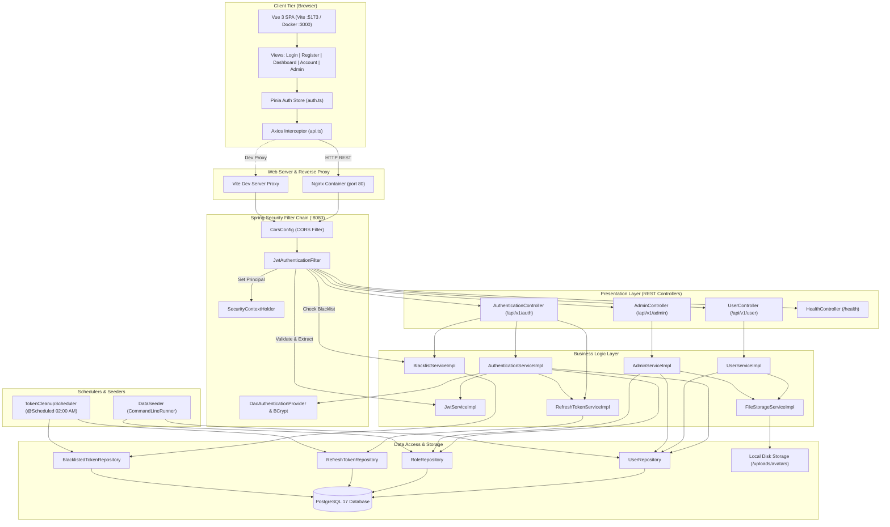
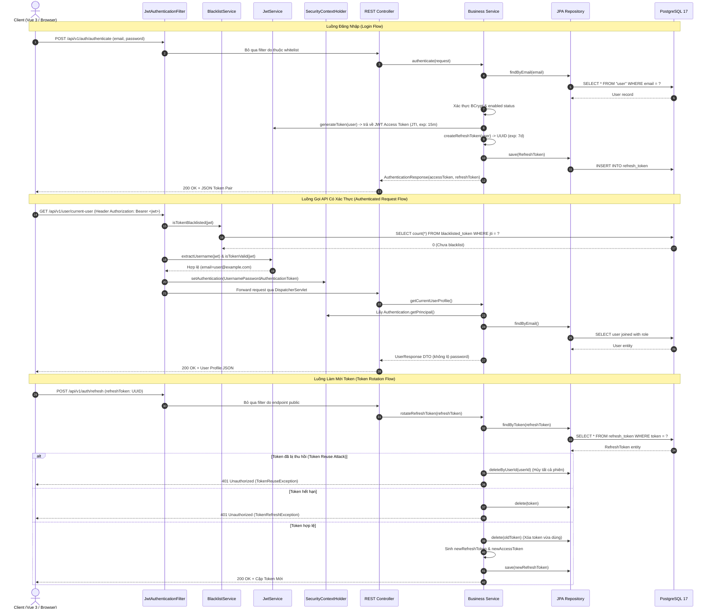

# BÁO CÁO PHÂN TÍCH TOÀN DIỆN MÃ NGUỒN (CODEBASE ANALYSIS REPORT)

**Repository:** `skill-management`  
**Đường dẫn Workspace:** `d:/Documents/Git Project/skill-management`  
**Ngày phân tích:** 12/09/2026  
**Trạng thái kiểm tra:** Hoàn thành phân tích tĩnh toàn diện (Evidence-based Static Analysis)  

---

## A. Repository Overview

- **Mục đích & Bản chất thực tế của Repository:**  
  Repository mang tên **`skill-management`**, tuy nhiên trong mã nguồn hiện tại **CHƯA CÓ BẤT KỲ MÔ HÌNH HOẶC TÍNH NĂNG NÀO VỀ KỸ NĂNG (SKILL)** (chưa có Skill, Category, Assessment hay Proficiency matrix).  
  Toàn bộ hệ thống hiện thực 100% là nền tảng **Quản lý người dùng, Xác thực & Phân quyền (Authentication, Authorization & User Profile Management)** theo mô hình Client-Server phân tầng, hỗ trợ chu kỳ sống JWT Token bảo mật cao.

- **Năng lực cốt lõi hiện có:**
  1. **Xác thực & Ủy quyền (Authentication & Authorization):** Đăng ký tài khoản, đăng nhập trả về cặp Access Token (JWT) + Refresh Token (UUID lưu DB), cơ chế xoay vòng Refresh Token (Token Rotation) kèm phát hiện tái sử dụng (Token Reuse Detection), thu hồi token khi đăng xuất (Access Token Blacklist) và đăng xuất khỏi mọi thiết bị (`logout-all`).
  2. **Quản lý Hồ sơ Cá nhân (Self-Service Profile):** Xem hồ sơ cá nhân, cập nhật họ tên / giới tính / số điện thoại, đổi mật khẩu (kiểm tra mật khẩu cũ), tải lên và thay thế ảnh đại diện avatar (lưu trữ file cục bộ), tự xóa tài khoản (chặn đối với ADMIN).
  3. **Quản trị Người dùng & Phân quyền (Admin Management):** Liệt kê toàn bộ người dùng, tạo tài khoản mới với vai trò chỉ định, thay đổi vai trò người dùng (bảo vệ không cho hạ cấp ADMIN), khóa/mở khóa tài khoản (chặn admin tự khóa chính mình), đặt lại mật khẩu tự động với chuỗi ngẫu nhiên bảo mật, xóa tài khoản người dùng theo ID hoặc Email (chặn admin tự xóa chính mình).
  4. **Hệ thống Vai trò Động (Dynamic RBAC):** Vai trò được quản lý trong bảng `role` với 3 quyền khởi tạo mặc định: `ADMIN`, `EDITOR`, `USER`.
  5. **Tác vụ Định kỳ Dọn dẹp (Scheduled Token Purge):** Tự động quét và xóa sạch các Refresh Token và Blacklisted Token đã hết hạn lúc 02:00 sáng hàng ngày.

- **Bố cục tổng thể kho mã nguồn:**
  - `backend/`: Ứng dụng Spring Boot 3.4.2 (Java 21 LTS) đóng gói theo chuẩn Maven đa tầng.
  - `frontend/`: Ứng dụng Single Page Application (SPA) xây dựng bằng Vue 3.5, TypeScript, Vite, Pinia và Element Plus.
  - `docs/`: Đặc tả kiến trúc, kế hoạch kỹ thuật (`plans/`, `specs/`), ma trận kiểm thử (`testcases/TESTCASE_CATALOG.csv`) và tài liệu phân tích.
  - Thư mục gốc: Cấu hình containerization Docker Compose và các tập lệnh batch vận hành cho môi trường Windows.

---

## B. Technology Stack and Runtime Requirements

### 1. Backend Runtime & Dependencies
- **Ngôn ngữ lập trình:** [Java 21 LTS](file:///d:/Documents/Git%20Project/skill-management/backend/pom.xml#L17) (sử dụng các tính năng hiện đại: Java Records cho DTO, Pattern Matching, Sealed Classes, Virtual Threads).
- **Khung ứng dụng:** [Spring Boot 3.4.2](file:///d:/Documents/Git%20Project/skill-management/backend/pom.xml#L8) (`spring-boot-starter-parent`).
- **Bảo mật:** [Spring Security 6.4.x](file:///d:/Documents/Git%20Project/skill-management/backend/pom.xml#L27-L31) với cấu hình Stateless Session, bộ lọc tùy biến [JwtAuthenticationFilter](file:///d:/Documents/Git%20Project/skill-management/backend/src/main/java/com/furelise/skillmanagement/config/filter/JwtAuthenticationFilter.java), hỗ trợ `@EnableMethodSecurity(securedEnabled = true, prePostEnabled = true)`.
- **Cơ sở dữ liệu & ORM:** PostgreSQL 17 (chạy trên Docker qua port `5433:5432`), kết nối qua [Spring Data JPA](file:///d:/Documents/Git%20Project/skill-management/backend/pom.xml#L33-L37) và Hibernate 6 (`spring.jpa.hibernate.ddl-auto: validate`).
- **Quản lý Migration:** [Flyway](file:///d:/Documents/Git%20Project/skill-management/backend/pom.xml#L58-L66) (`flyway-core`, `flyway-database-postgresql`).
- **Xử lý Token:** [jjwt 0.12.6](file:///d:/Documents/Git%20Project/skill-management/backend/pom.xml#L68-L85) (`jjwt-api`, `jjwt-impl`, `jjwt-jackson`) ký thuật toán HMAC-SHA256.
- **Giảm thiểu mã mẫu:** Project Lombok (chỉ sử dụng cho các thực thể JPA Entity mutable).
- **Xác thực dữ liệu:** [Spring Boot Starter Validation](file:///d:/Documents/Git%20Project/skill-management/backend/pom.xml#L40-L43) (`jakarta.validation`).
- **Giám sát & Vận hành:** [Spring Boot Starter Actuator](file:///d:/Documents/Git%20Project/skill-management/backend/pom.xml#L45-L49) (mở các endpoint `/actuator/health`, `/actuator/info`).
- **Tối ưu hóa đa luồng:** Bật Virtual Threads thông qua `spring.threads.virtual.enabled: true` trong [application.yml](file:///d:/Documents/Git%20Project/skill-management/backend/src/main/resources/application.yml#L28-L30).

### 2. Frontend Runtime & Dependencies
- **Khung giao diện:** [Vue 3.5.40](file:///d:/Documents/Git%20Project/skill-management/frontend/package.json#L23) (Composition API, `<script setup>`).
- **Ngôn ngữ:** [TypeScript ~6.0.0](file:///d:/Documents/Git%20Project/skill-management/frontend/package.json#L44).
- **Công cụ build & Dev Server:** [Vite ^8.1.5](file:///d:/Documents/Git%20Project/skill-management/frontend/package.json#L47).
- **Quản lý trạng thái:** [Pinia ^4.0.2](file:///d:/Documents/Git%20Project/skill-management/frontend/package.json#L22) (Setup Store pattern).
- **Điều hướng:** [Vue Router ^5.2.0](file:///d:/Documents/Git%20Project/skill-management/frontend/package.json#L24) (HTML5 History mode, Navigation Guard).
- **Thư viện UI:** [Element Plus ^2.14.5](file:///d:/Documents/Git%20Project/skill-management/frontend/package.json#L21) cùng bộ icon `@element-plus/icons-vue ^2.3.2`, tích hợp tự động nạp component qua `unplugin-auto-import` và `unplugin-vue-components`.
- **Giao tiếp HTTP:** [Axios ^1.20.0](file:///d:/Documents/Git%20Project/skill-management/frontend/package.json#L20) với request/response interceptor.
- **Công cụ kiểm thử:** Vitest ^4.1.10, `@vue/test-utils` ^2.4.11, JSDOM ^29.1.1.
- **Linting & Code Quality:** ESLint ^10.7.0, Oxlint ~1.74.0, Prettier 3.9.5.
- **Yêu cầu Node.js:** `package.json` quy định `engines.node: "^22.18.0 || >=24.12.0"`.

### 3. Hạ tầng & Môi trường triển khai
- **Docker Compose:** Định nghĩa 3 dịch vụ liên kết trong mạng `skill-mgmt-network`:
  1. `skill-mgmt-postgres`: Container PostgreSQL 17 Alpine, mở port máy chủ `5433:5432`, mount volume `pgdata`.
  2. `skill-mgmt-backend`: Container đa tầng biên dịch Java 21 JRE, port 8080, phụ thuộc postgres healthy.
  3. `skill-mgmt-frontend`: Container Nginx Alpine phục vụ file tĩnh và reverse proxy, port máy chủ 3000, phụ thuộc backend healthy.
- **Tập lệnh vận hành Windows:**
  - [start-all.bat](file:///d:/Documents/Git%20Project/skill-management/start-all.bat): Kiểm tra/khởi động container Docker DB, sau đó mở 2 cửa sổ riêng biệt cho backend và frontend.
  - [start-backend.bat](file:///d:/Documents/Git%20Project/skill-management/start-backend.bat): Kiểm tra socket port 5433 rồi chạy `mvnw.cmd spring-boot:run`.
  - [start-frontend.bat](file:///d:/Documents/Git%20Project/skill-management/start-frontend.bat): Kiểm tra backend port 8080 rồi chạy `npm.cmd run dev`.
  - [stop-all.bat](file:///d:/Documents/Git%20Project/skill-management/stop-all.bat): Quét PID đang chiếm giữ port 8080, 5173 và buộc dừng toàn bộ tiến trình liên quan.

---

## C. Directory and Module Map

```
skill-management/
├── backend/                                   # Module Backend (Spring Boot 3.4.2)
│   ├── pom.xml                               # Định nghĩa phụ thuộc & cấu hình build Maven
│   ├── Dockerfile                            # Dockerfile đa tầng (temurin:21-jdk -> temurin:21-jre)
│   ├── mvnw / mvnw.cmd                       # Maven Wrapper cross-platform
│   └── src/
│       ├── main/java/com/furelise/skillmanagement/
│       │   ├── SkillManagementApplication.java# Điểm nhập ứng dụng, kích hoạt @EnableScheduling
│       │   ├── config/                       # Các lớp cấu hình Bean hệ thống
│       │   │   ├── ApplicationConfig.java    # Cấu hình UserDetailsService, PasswordEncoder, AuthProvider
│       │   │   ├── CorsConfig.java           # Cấu hình CORS Web MVC và Spring Security
│       │   │   ├── DataSeeder.java           # CommandLineRunner khởi tạo quyền và tài khoản admin mẫu
│       │   │   ├── SecurityConfig.java       # Chuỗi lọc bảo mật SecurityFilterChain & phân quyền endpoint
│       │   │   ├── WebMvcConfig.java         # Cấu hình ResourceHandler phục vụ file tĩnh (/uploads/avatars/**)
│       │   │   └── filter/
│       │   │       └── JwtAuthenticationFilter.java # Filter kiểm tra tính hợp lệ và blacklist của JWT
│       │   ├── controller/                   # Tầng REST Controllers tiếp nhận request HTTP
│       │   │   ├── AdminController.java      # Endpoint quản trị người dùng & vai trò (@Secured ROLE_ADMIN)
│       │   │   ├── AuthenticationController.java # Endpoint xác thực, đăng ký, refresh token, đăng xuất
│       │   │   ├── HealthController.java     # Endpoint kiểm tra sức khỏe ứng dụng (/health)
│       │   │   └── UserController.java       # Endpoint cá nhân của người dùng đang đăng nhập
│       │   ├── dto/                          # Java 21 Records đóng gói dữ liệu request & response
│       │   │   ├── AuthenticationRequest.java
│       │   │   ├── AuthenticationResponse.java
│       │   │   ├── ChangePasswordRequest.java
│       │   │   ├── CreateUserRequest.java
│       │   │   ├── LogoutRequest.java
│       │   │   ├── MessageResponse.java
│       │   │   ├── RefreshTokenRequest.java
│       │   │   ├── RegisterRequest.java
│       │   │   ├── ResetPasswordResponse.java
│       │   │   ├── UpdateProfileRequest.java
│       │   │   ├── UpdateRoleRequest.java
│       │   │   ├── UpdateStatusRequest.java
│       │   │   └── UserResponse.java
│       │   ├── exception/                    # Xử lý ngoại lệ tập trung
│       │   │   ├── GlobalExceptionHandler.java # @RestControllerAdvice định dạng lỗi trả về chuẩn REST
│       │   │   ├── TokenRefreshException.java # Ngoại lệ token làm mới không hợp lệ hoặc hết hạn
│       │   │   └── TokenReuseException.java   # Ngoại lệ phát hiện token bị tái sử dụng trái phép
│       │   ├── model/                        # Tầng JPA Entities ánh xạ cơ sở dữ liệu
│       │   │   ├── BlacklistedToken.java     # Thực thể lưu trữ JTI các token đã logout
│       │   │   ├── RefreshToken.java         # Thực thể lưu trữ Refresh Token theo người dùng
│       │   │   ├── Role.java                 # Thực thể vai trò động (ADMIN, EDITOR, USER)
│       │   │   └── User.java                 # Thực thể tài khoản người dùng, hiện thực UserDetails
│       │   ├── repository/                   # Tầng Spring Data JPA Repositories
│       │   │   ├── BlacklistedTokenRepository.java
│       │   │   ├── RefreshTokenRepository.java
│       │   │   ├── RoleRepository.java
│       │   │   └── UserRepository.java
│       │   ├── scheduler/                    # Tác vụ chạy ngầm định kỳ
│       │   │   └── TokenCleanupScheduler.java # Quét xóa token hết hạn lúc 02:00 hàng ngày
│       │   └── service/                      # Giao diện & hiện thực logic nghiệp vụ
│       │       ├── AdminService.java / impl/AdminServiceImpl.java
│       │       ├── AuthenticationService.java / impl/AuthenticationServiceImpl.java
│       │       ├── BlacklistService.java / impl/BlacklistServiceImpl.java
│       │       ├── FileStorageService.java / impl/FileStorageServiceImpl.java
│       │       ├── JwtService.java / impl/JwtServiceImpl.java
│       │       ├── RefreshTokenService.java / impl/RefreshTokenServiceImpl.java
│       │       └── UserService.java / impl/UserServiceImpl.java
│       ├── main/resources/
│       │   ├── application.yml               # Cấu hình chính của Spring Boot (Datasource, JWT, CORS)
│       │   └── db/migration/                 # Các kịch bản Flyway Migration cho PostgreSQL
│       │       ├── V1__init_schema.sql       # Khởi tạo bảng _user
│       │       ├── V2__add_role_and_user_fields.sql # Tạo bảng role, khóa ngoại role_id, avatar_url, enabled
│       │       ├── V3__rename_user_table.sql # Đổi tên bảng _user thành "user"
│       │       └── V4__add_refresh_and_blacklist_tokens.sql # Thêm bảng refresh_token và blacklisted_token
│       └── test/                             # Bộ kiểm thử tự động của Backend
│           ├── resources/application-test.yml# Cấu hình kiểm thử dùng H2 In-Memory DB
│           └── java/com/furelise/skillmanagement/
│               ├── SkillManagementApplicationTests.java
│               ├── config/filter/JwtAuthenticationFilterTest.java
│               ├── controller/AuthenticationControllerTest.java
│               ├── repository/RoleRepositoryTest.java, TokenRepositoriesTest.java
│               ├── scheduler/TokenCleanupSchedulerTest.java
│               └── service/*Test.java (7 bộ unit test cho toàn bộ services)
│
├── frontend/                                  # Module Frontend (Vue 3 SPA)
│   ├── package.json                          # Khai báo phụ thuộc npm & scripts
│   ├── vite.config.ts                        # Cấu hình Vite, proxy `/api` và resolver Element Plus
│   ├── nginx.conf                            # Cấu hình Nginx reverse proxy cho production Docker
│   ├── Dockerfile                            # Dockerfile đa tầng build Vite -> Nginx
│   └── src/
│       ├── main.ts                           # Điểm nhập khởi tạo Vue, Pinia, Router, Element Plus
│       ├── App.vue                           # Component gốc chứa `<router-view />`
│       ├── assets/main.css                   # Định kiểu CSS toàn cục
│       ├── router/index.ts                   # Định nghĩa tuyến đường & navigation guard
│       ├── stores/auth.ts                    # Pinia Setup Store quản lý phiên người dùng
│       ├── stores/__tests__/auth.spec.ts     # Vitest kiểm thử auth store
│       ├── services/                         # Tầng gọi API qua Axios
│       │   ├── api.ts                        # Cấu hình Axios instance & interceptors
│       │   ├── adminService.ts               # Các hàm gọi API quản trị
│       │   ├── authService.ts                # Các hàm gọi API xác thực
│       │   └── userService.ts                # Các hàm gọi API hồ sơ cá nhân
│       ├── types/index.ts                    # Khai báo kiểu dữ liệu TypeScript
│       └── views/                            # Các màn hình giao diện người dùng
│           ├── AccountInfoView.vue           # Màn hình đổi thông tin, đổi pass, upload avatar, xóa tài khoản
│           ├── AdminView.vue                 # Bảng điều khiển quản trị danh sách người dùng, vai trò
│           ├── DashboardView.vue             # Màn hình chính sau khi đăng nhập
│           ├── LoginView.vue                 # Màn hình đăng nhập
│           └── RegisterView.vue              # Màn hình đăng ký tài khoản mới
│
├── docs/                                     # Tài liệu hướng dẫn & kiểm thử
│   ├── superpowers/                          # Lịch sử thiết kế & kế hoạch thực hiện
│   │   ├── plans/                            # Các file kế hoạch chi tiết
│   │   └── specs/                            # Các file đặc tả kỹ thuật
│   └── testcases/TESTCASE_CATALOG.csv        # Danh mục 45 test case chuẩn QA
│
├── docker-compose.yml                         # Cấu hình chạy PostgreSQL, Backend, Frontend
├── start-all.bat / stop-all.bat               # Kịch bản khởi động/dừng nhanh trên Windows
├── start-backend.bat / start-frontend.bat     # Kịch bản chạy độc lập từng module
└── README.md                                 # Hướng dẫn tổng quan & cài đặt nhanh
```

---

## D. Architecture and Component Responsibilities

### 1. Sơ đồ Kiến trúc Hệ thống Tổng thể (Mermaid Architecture Diagram)



### 2. Trách nhiệm của các Thành phần
- **`JwtAuthenticationFilter`:** Chặn toàn bộ các request vào backend; phân giải header `Authorization: Bearer <token>`; kiểm tra xem JTI của token có nằm trong bảng blacklist hay không thông qua [BlacklistService](file:///d:/Documents/Git%20Project/skill-management/backend/src/main/java/com/furelise/skillmanagement/service/impl/BlacklistServiceImpl.java#L45-L56); nếu hợp lệ thì giải mã và thiết lập đối tượng xác thực vào [SecurityContextHolder](file:///d:/Documents/Git%20Project/skill-management/backend/src/main/java/com/furelise/skillmanagement/config/filter/JwtAuthenticationFilter.java#L71).
- **`SecurityConfig`:** Khai báo cấu hình phân quyền đường dẫn (whitelist: `/api/v1/auth/**`, `/health/**`, `/actuator/**`, `/uploads/**`; các endpoint còn lại bắt buộc đăng nhập); kích hoạt xác thực phân quyền ở cấp độ phương thức bằng `@EnableMethodSecurity`.
- **`AuthenticationServiceImpl`:** Thực hiện đăng ký tài khoản (mặc định gán vai trò `USER`), mã hóa mật khẩu bằng BCrypt, và ủy thác đăng nhập cho `AuthenticationManager`.
- **`RefreshTokenServiceImpl`:** Đảm trách sinh token làm mới (UUID ngẫu nhiên, hạn 7 ngày); khi client gọi refresh sẽ xoay vòng token (xóa token cũ, sinh token mới); nếu phát hiện token đã thu hồi/tái sử dụng (`isRevoked()`) sẽ kích hoạt cơ chế tự bảo vệ bằng cách xóa sạch toàn bộ phiên đăng nhập của người dùng đó ([RefreshTokenServiceImpl.java:L56-L60](file:///d:/Documents/Git%20Project/skill-management/backend/src/main/java/com/furelise/skillmanagement/service/impl/RefreshTokenServiceImpl.java#L56-L60)).
- **`BlacklistServiceImpl`:** Lưu trữ các JTI của Access Token đã đăng xuất vào cơ sở dữ liệu cùng thời điểm hết hạn để từ chối các request tiếp theo dùng token đó.
- **`UserServiceImpl`:** Cung cấp chức năng cho người dùng hiện tại lấy thông tin bản thân, chỉnh sửa thông tin, đổi mật khẩu, tải lên ảnh đại diện và tự hủy tài khoản cá nhân.
- **`AdminServiceImpl`:** Thực hiện các quyền tối cao: quản lý danh sách tài khoản, tạo người dùng với vai trò bất kỳ, chuyển đổi vai trò, bật/tắt trạng thái hoạt động, tự động sinh mật khẩu ngẫu nhiên độ an toàn cao để reset, và xóa tài khoản. Chứa các quy tắc nghiệp vụ bảo vệ hệ thống không bị mất quyền admin.
- **`FileStorageServiceImpl`:** Quản lý ghi file lên ổ cứng tại thư mục `uploads/avatars/`, kiểm tra định dạng (JPG, PNG, WEBP), giới hạn dung lượng 5MB và tự động dọn dẹp file cũ khi cập nhật hoặc xóa tài khoản.
- **`TokenCleanupScheduler`:** Chạy ngầm hàng ngày bằng cron expression, giải phóng dung lượng DB bằng cách dọn dẹp các token đã quá hạn sử dụng.

---

## E. Main Execution Flows

### 1. Sơ đồ Luồng Xác thực & Xử lý Yêu cầu (Request Execution Lifecycle)



### 2. Các Luồng Thực thi Chính Chi tiết
1. **Luồng Đăng ký Tài khoản mới (`POST /api/v1/auth/register`):**
   - Tiếp nhận [RegisterRequest](file:///d:/Documents/Git%20Project/skill-management/backend/src/main/java/com/furelise/skillmanagement/dto/RegisterRequest.java) có kiểm tra Bean Validation (tên không rỗng, email đúng định dạng, mật khẩu >= 8 ký tự).
   - Kiểm tra trùng email trong database. Nếu trùng ném lỗi `IllegalArgumentException` (HTTP 400).
   - Truy vấn vai trò `USER` từ bảng `role` (nếu chưa có thì tạo mới).
   - Mã hóa mật khẩu bằng `BCryptPasswordEncoder` và lưu bản ghi vào bảng `"user"`.
   - Sinh Access Token (15 phút) và Refresh Token (7 ngày), trả về mã HTTP 201 Created.
2. **Luồng Cập nhật Avatar (`POST /api/v1/user/avatar`):**
   - Nhận file qua multipart form data `avatar`.
   - [FileStorageServiceImpl](file:///d:/Documents/Git%20Project/skill-management/backend/src/main/java/com/furelise/skillmanagement/service/impl/FileStorageServiceImpl.java#L34-L65) kiểm tra định dạng hợp lệ (chỉ cho phép `.jpg`, `.jpeg`, `.png`, `.webp`) và dung lượng <= 5MB.
   - Xóa file ảnh avatar cũ trên đĩa nếu có.
   - Đặt tên file mới theo định dạng `avatar_{userId}_{timestamp}.{ext}` và lưu vào thư mục `uploads/avatars/`.
   - Cập nhật đường dẫn `/uploads/avatars/{filename}` vào trường `avatar_url` của User trong DB.
3. **Luồng Đăng xuất & Blacklist (`POST /api/v1/auth/logout`):**
   - Trích xuất Access Token từ header `Authorization: Bearer <token>`.
   - Lấy claim `jti` và thời gian hết hạn `exp`, ghi bản ghi mới vào bảng `blacklisted_token`.
   - Nếu client gửi kèm Refresh Token trong body, tiến hành xóa bản ghi tương ứng trong bảng `refresh_token`.
4. **Luồng Đăng xuất toàn bộ thiết bị (`POST /api/v1/auth/logout-all`):**
   - Yêu cầu người dùng đã đăng nhập (`@AuthenticationPrincipal User currentUser`).
   - Đưa Access Token hiện tại vào bảng `blacklisted_token`.
   - Gọi `refreshTokenRepository.deleteByUserId(currentUser.getId())` để vô hiệu hóa ngay lập tức toàn bộ Refresh Token của tài khoản trên mọi trình duyệt/thiết bị.
5. **Luồng Bảo vệ Quản trị viên khi Thay đổi Trạng thái / Xóa User:**
   - Trong [AdminServiceImpl.java](file:///d:/Documents/Git%20Project/skill-management/backend/src/main/java/com/furelise/skillmanagement/service/impl/AdminServiceImpl.java):
     - Không cho phép thay đổi vai trò hoặc hạ cấp người dùng mang vai trò `ADMIN` ([L85-L87](file:///d:/Documents/Git%20Project/skill-management/backend/src/main/java/com/furelise/skillmanagement/service/impl/AdminServiceImpl.java#L85-L87)).
     - Không cho phép Admin tự khóa tài khoản của chính mình ([L103-L105](file:///d:/Documents/Git%20Project/skill-management/backend/src/main/java/com/furelise/skillmanagement/service/impl/AdminServiceImpl.java#L103-L105)).
     - Không cho phép Admin tự xóa tài khoản của chính mình ([L131-L133](file:///d:/Documents/Git%20Project/skill-management/backend/src/main/java/com/furelise/skillmanagement/service/impl/AdminServiceImpl.java#L131-L133)).
     - Khi xóa người dùng (theo ID hoặc Email), tự động gọi [FileStorageService.deleteAvatar](file:///d:/Documents/Git%20Project/skill-management/backend/src/main/java/com/furelise/skillmanagement/service/impl/FileStorageServiceImpl.java#L68-L79) để dọn dẹp file ảnh trên đĩa cứng.

---

## F. API, Data, and Integration Map

### 1. Ma trận API Endpoints (API Specification)

| HTTP Method | Đường dẫn Endpoint | Quyền hạn truy cập | Request Body / Param | Response Payload | Ghi chú bảo mật & Nghiệp vụ |
|:---|:---|:---|:---|:---|:---|
| **POST** | `/api/v1/auth/register` | Public (Không cần token) | `RegisterRequest` (JSON) | `AuthenticationResponse` | Trả về access token + refresh token |
| **POST** | `/api/v1/auth/authenticate` | Public | `AuthenticationRequest` (JSON) | `AuthenticationResponse` | Đăng nhập hệ thống |
| **POST** | `/api/v1/auth/refresh` | Public | `RefreshTokenRequest` (JSON) | `AuthenticationResponse` | Xoay vòng refresh token, phát hiện gian lận |
| **POST** | `/api/v1/auth/logout` | Public (Khuyến nghị gửi kèm token) | Header Auth + `LogoutRequest` | `MessageResponse` | Đưa JWT vào blacklist, thu hồi refresh token |
| **POST** | `/api/v1/auth/logout-all` | Authenticated (Mọi vai trò) | Header Auth | `MessageResponse` | Xóa tất cả refresh token của user trong DB |
| **GET** | `/api/v1/user/current-user` | Authenticated | Header Auth | `UserResponse` | Xem thông tin tài khoản hiện tại |
| **PUT** | `/api/v1/user/profile` | Authenticated | `UpdateProfileRequest` (JSON) | `UserResponse` | Sửa họ tên, giới tính, số điện thoại |
| **PUT** | `/api/v1/user/change-password` | Authenticated | `ChangePasswordRequest` (JSON) | `{ message: string }` | Bắt buộc đối chiếu mật khẩu cũ qua BCrypt |
| **POST** | `/api/v1/user/avatar` | Authenticated | Multipart `avatar` (File <= 5MB) | `{ avatarUrl: string }` | Upload ảnh JPG/PNG/WEBP |
| **DELETE** | `/api/v1/user/account` | Authenticated | Header Auth | `{ message: string }` | Tự xóa tài khoản (chặn tài khoản ADMIN) |
| **GET** | `/api/v1/admin/roles` | Admin Only (`ROLE_ADMIN`) | Header Auth | `List<Role>` | Lấy danh sách vai trò hệ thống |
| **GET** | `/api/v1/admin/get-users` | Admin Only (`ROLE_ADMIN`) | Header Auth | `List<UserResponse>` | Lấy danh sách toàn bộ người dùng |
| **POST** | `/api/v1/admin/create-user` | Admin Only (`ROLE_ADMIN`) | `CreateUserRequest` (JSON) | `UserResponse` | Tạo tài khoản người dùng trực tiếp |
| **PUT** | `/api/v1/admin/users/{id}/role` | Admin Only (`ROLE_ADMIN`) | `UpdateRoleRequest` (JSON) | `UserResponse` | Đổi vai trò (chặn hạ cấp ADMIN) |
| **PUT** | `/api/v1/admin/users/{id}/status` | Admin Only (`ROLE_ADMIN`) | `UpdateStatusRequest` (JSON) | `UserResponse` | Khóa/Mở khóa (chặn admin tự khóa mình) |
| **POST** | `/api/v1/admin/users/{id}/reset-password` | Admin Only (`ROLE_ADMIN`) | URL Path ID | `ResetPasswordResponse` | Sinh ngẫu nhiên mật khẩu mạnh |
| **DELETE** | `/api/v1/admin/delete-user/{email}` | Admin Only (`ROLE_ADMIN`) | URL Path Email | `{ message: string }` | Xóa tài khoản theo email |
| **DELETE** | `/api/v1/admin/users/{id}` | Admin Only (`ROLE_ADMIN`) | URL Path ID | `{ message: string }` | Xóa tài khoản theo ID |
| **GET** | `/health` | Public | Không | `{ status, timestamp, application }` | Kiểm tra trạng thái máy chủ |
| **GET** | `/actuator/health`, `/actuator/info` | Public | Không | JSON Actuator | Giám sát container healthcheck |
| **GET** | `/uploads/avatars/**` | Public | URL resource | Binary file | Phục vụ file avatar tĩnh từ ổ đĩa |

### 2. Mô hình Cơ sở Dữ liệu & Tiến trình Migration
Cơ sở dữ liệu PostgreSQL 17 quản lý bởi Flyway với 4 phiên bản migration:
- **`role` (Tạo từ [V2](file:///d:/Documents/Git%20Project/skill-management/backend/src/main/resources/db/migration/V2__add_role_and_user_fields.sql)):**
  - `id` (BIGSERIAL PK), `name` (VARCHAR(50) NOT NULL UNIQUE), `description` (VARCHAR(255)).
  - Dữ liệu khởi tạo: `ADMIN`, `EDITOR`, `USER`.
- **`"user"` (Tạo từ [V1](file:///d:/Documents/Git%20Project/skill-management/backend/src/main/resources/db/migration/V1__init_schema.sql), sửa tại [V2](file:///d:/Documents/Git%20Project/skill-management/backend/src/main/resources/db/migration/V2__add_role_and_user_fields.sql), đổi tên bảng tại [V3](file:///d:/Documents/Git%20Project/skill-management/backend/src/main/resources/db/migration/V3__rename_user_table.sql)):**
  - `id` (BIGSERIAL PK), `name` (VARCHAR(255)), `email` (VARCHAR(255) NOT NULL UNIQUE), `gender` (VARCHAR(50)), `mobile` (VARCHAR(20)), `password` (VARCHAR(255) NOT NULL), `role_id` (BIGINT NOT NULL FK -> role(id)), `enabled` (BOOLEAN NOT NULL DEFAULT TRUE), `avatar_url` (VARCHAR(255)), `created_at` (TIMESTAMPTZ), `updated_at` (TIMESTAMPTZ).
  - Chỉ mục: `idx_user_email` trên `email`, `idx_user_role_id` trên `role_id`.
- **`refresh_token` (Tạo từ [V4](file:///d:/Documents/Git%20Project/skill-management/backend/src/main/resources/db/migration/V4__add_refresh_and_blacklist_tokens.sql)):**
  - `id` (BIGSERIAL PK), `token` (VARCHAR(255) NOT NULL UNIQUE), `user_id` (BIGINT NOT NULL FK -> "user"(id) ON DELETE CASCADE), `expiry_date` (TIMESTAMPTZ NOT NULL), `revoked` (BOOLEAN NOT NULL DEFAULT FALSE), `created_at` (TIMESTAMPTZ NOT NULL).
  - Chỉ mục: `idx_refresh_token_token`, `idx_refresh_token_user_id`, `idx_refresh_token_expiry`.
- **`blacklisted_token` (Tạo từ [V4](file:///d:/Documents/Git%20Project/skill-management/backend/src/main/resources/db/migration/V4__add_refresh_and_blacklist_tokens.sql)):**
  - `id` (BIGSERIAL PK), `jti` (VARCHAR(36) NOT NULL UNIQUE), `expiry_date` (TIMESTAMPTZ NOT NULL), `blacklisted_at` (TIMESTAMPTZ NOT NULL).
  - Chỉ mục: `idx_blacklisted_token_jti`, `idx_blacklisted_token_expiry`.

---

## G. Dependency Map and Critical Code Paths

### 1. Phụ thuộc Nội bộ & Luồng Dữ liệu giữa các Package
- **Cấu hình & Bộ lọc:**  
  [SecurityConfig](file:///d:/Documents/Git%20Project/skill-management/backend/src/main/java/com/furelise/skillmanagement/config/SecurityConfig.java) tiêm [JwtAuthenticationFilter](file:///d:/Documents/Git%20Project/skill-management/backend/src/main/java/com/furelise/skillmanagement/config/filter/JwtAuthenticationFilter.java) và `AuthenticationProvider`. Filter phụ thuộc vào [JwtService](file:///d:/Documents/Git%20Project/skill-management/backend/src/main/java/com/furelise/skillmanagement/service/JwtService.java), [BlacklistService](file:///d:/Documents/Git%20Project/skill-management/backend/src/main/java/com/furelise/skillmanagement/service/BlacklistService.java), và `UserDetailsService`.
- **Tầng Giao tiếp & Tầng Nghiệp vụ:**  
  Các Controller chỉ tiêm Service Interface, hoàn toàn độc lập với các lớp `*ServiceImpl`.
- **Tầng Nghiệp vụ & Dữ liệu:**  
  Các Service gọi Spring Data JPA Repositories và FileStorageService. Không có phụ thuộc vòng (circular dependency) nào giữa các Service.
- **Frontend Layering:**  
  `Views` -> gọi Pinia `authStore` & `services/*.ts` -> `services/api.ts` -> gửi HTTP request.

### 2. Các Đường dẫn Code Trọng yếu (Critical Code Paths)
1. **`JwtAuthenticationFilter.doFilterInternal`:**  
   Thực thi trên **từng HTTP request** gửi tới backend. Thực hiện truy vấn `blacklistedTokenRepository.existsByJti(jti)` trực tiếp vào PostgreSQL. Nếu cơ sở dữ liệu bị nghẽn I/O, toàn bộ các request (kể cả request đọc dữ liệu đơn giản) đều bị ảnh hưởng độ trễ.
2. **`RefreshTokenServiceImpl.rotateRefreshToken`:**  
   Đường dẫn kiểm tra an ninh cực kỳ nhạy cảm. Quản lý việc kiểm tra tính hợp lệ, phát hiện tái sử dụng trái phép (Token Reuse) và thu hồi toàn bộ token của tài khoản để ngăn chặn tấn công chiếm quyền phiên làm việc.
3. **`AdminServiceImpl.updateUserRole` & `updateUserStatus`:**  
   Đảm bảo không bao giờ xảy ra tình trạng mất tài khoản Admin duy nhất (khóa nhầm chính mình hoặc hạ cấp toàn bộ Admin thành User).
4. **`FileStorageServiceImpl.storeAvatar`:**  
   Thực hiện thao tác I/O ghi file nhị phân vào đĩa cứng máy chủ. Cần kiểm soát chặt chẽ để chống tấn công Path Traversal hoặc cạn kiệt dung lượng đĩa do upload file độc hại.

---

## H. Test, Build, Deployment, and Operational Workflow

### 1. Chiến lược Kiểm thử (Testing Strategy)
- **Backend Test Suite (13 file kiểm thử tự động):**
  - **Context & Integration:** [SkillManagementApplicationTests.java](file:///d:/Documents/Git%20Project/skill-management/backend/src/test/java/com/furelise/skillmanagement/SkillManagementApplicationTests.java) kiểm tra nạp Spring Context.
  - **Controller Tests:** [AuthenticationControllerTest.java](file:///d:/Documents/Git%20Project/skill-management/backend/src/test/java/com/furelise/skillmanagement/controller/AuthenticationControllerTest.java) sử dụng `@SpringBootTest` + `MockMvc` và `@ActiveProfiles("test")` kiểm tra các endpoint auth (authenticate, refresh, logout).
  - **Repository Tests:** [TokenRepositoriesTest.java](file:///d:/Documents/Git%20Project/skill-management/backend/src/test/java/com/furelise/skillmanagement/repository/TokenRepositoriesTest.java) và [RoleRepositoryTest.java](file:///d:/Documents/Git%20Project/skill-management/backend/src/test/java/com/furelise/skillmanagement/repository/RoleRepositoryTest.java) dùng `@DataJpaTest` chạy trên cơ sở dữ liệu in-memory H2 với chế độ tương thích PostgreSQL (`MODE=PostgreSQL`).
  - **Service Unit Tests:** Toàn bộ 7 service đều có unit test tương ứng sử dụng Mockito (`AdminServiceTest`, `UserServiceTest`, `AuthenticationServiceTest`, `RefreshTokenServiceTest`, `BlacklistServiceTest`, `JwtServiceTest`, `FileStorageServiceTest`).
  - **Filter & Scheduler Tests:** [JwtAuthenticationFilterTest.java](file:///d:/Documents/Git%20Project/skill-management/backend/src/test/java/com/furelise/skillmanagement/config/filter/JwtAuthenticationFilterTest.java) và [TokenCleanupSchedulerTest.java](file:///d:/Documents/Git%20Project/skill-management/backend/src/test/java/com/furelise/skillmanagement/scheduler/TokenCleanupSchedulerTest.java).
- **Frontend Test Suite:**
  - [auth.spec.ts](file:///d:/Documents/Git%20Project/skill-management/frontend/src/stores/__tests__/auth.spec.ts) sử dụng Vitest và `@vue/test-utils` kiểm tra trạng thái khởi tạo và hàm `logout()` của Pinia Auth Store.
- **QA Test Case Catalog:**  
  [TESTCASE_CATALOG.csv](file:///d:/Documents/Git%20Project/skill-management/docs/testcases/TESTCASE_CATALOG.csv) định nghĩa chi tiết 45 ca kiểm thử chuẩn (từ TC-HLT-001 đến TC-E2E-003) bao gồm cả độ ưu tiên (P0, P1, P2), điều kiện tiên quyết, các bước thực hiện và kết quả kỳ vọng.

### 2. Quy trình Build & Đóng gói
- **Backend:**  
  Chạy `./mvnw clean package -DskipTests` tạo file JAR thực thi trong `backend/target/`. Quá trình build đóng gói loại trừ Lombok nhờ cấu hình `spring-boot-maven-plugin`.
- **Frontend:**  
  Chạy `npm run build` kích hoạt song song `vue-tsc --build` (kiểm tra kiểu TypeScript) và `vite build` tạo ra thư mục phân phối tĩnh `dist/`.

### 3. Quy trình Triển khai & Vận hành
- **Triển khai Container bằng Docker Compose:**  
  Chạy lệnh `docker compose up --build -d` khởi động 3 container theo thứ tự: PostgreSQL -> Backend (chờ DB kiểm tra `pg_isready` thành công) -> Frontend (chờ Backend vượt qua kiểm tra `/actuator/health`).
- **Môi trường Phát triển Windows Cục bộ:**  
  Người dùng có thể khởi động nhanh toàn bộ bằng cách click đúp vào [start-all.bat](file:///d:/Documents/Git%20Project/skill-management/start-all.bat) hoặc dừng sạch sẽ qua [stop-all.bat](file:///d:/Documents/Git%20Project/skill-management/stop-all.bat).

---

## I. Risks, Ambiguities, Technical Debt, and Missing Documentation

### 1. Khoảng cách Nghiệp vụ Nghiêm trọng (Domain Gap)
- **Vấn đề:** Tên dự án là `skill-management`, nhưng hiện tại **hoàn toàn chưa có thực thể, bảng DB hay API nào liên quan đến Kỹ năng**. Hệ thống mới chỉ dừng lại ở tầng Quản lý Người dùng và Phân quyền (User & Auth Management).

### 2. Sự Lệch pha giữa Backend và Frontend về Quản lý Token (Critical Debt)
- **Vấn đề:** Backend đã xây dựng đầy đủ cơ chế Refresh Token xoay vòng (`/api/v1/auth/refresh`), đăng xuất đưa token vào blacklist (`/api/v1/auth/logout`), và đăng xuất mọi thiết bị (`/api/v1/auth/logout-all`).  
  Tuy nhiên, **Frontend hoàn toàn bỏ qua Refresh Token**:
  - Tại [frontend/src/services/api.ts](file:///d:/Documents/Git%20Project/skill-management/frontend/src/services/api.ts#L24-L33), khi nhận lỗi HTTP 401, interceptor lập tức xóa `localStorage.removeItem('token')` và chuyển hướng thẳng về trang `/login` mà không hề gọi `/auth/refresh` để xin cấp token mới.
  - Tại [frontend/src/stores/auth.ts](file:///d:/Documents/Git%20Project/skill-management/frontend/src/stores/auth.ts#L53-L58), hàm `logout()` chỉ xóa token ở client và chuyển trang; nó **không hề gửi HTTP POST tới `/api/v1/auth/logout`**, dẫn đến Access Token trên server vẫn còn hiệu lực đầy đủ cho đến khi tự hết hạn (15 phút).

### 3. Nghẽn Hiệu năng Cơ sở Dữ liệu do Kiểm tra Blacklist trên Mọi Request
- **Vấn đề:** Tại [JwtAuthenticationFilter.java](file:///d:/Documents/Git%20Project/skill-management/backend/src/main/java/com/furelise/skillmanagement/config/filter/JwtAuthenticationFilter.java#L51), mỗi request HTTP có gửi Bearer Token đều kích hoạt truy vấn `existsByJti` vào bảng PostgreSQL `blacklisted_token`. Khi lượng người dùng tăng cao, việc truy vấn ổ cứng cơ sở dữ liệu trên từng request đơn lẻ sẽ gây quá tải connection pool và làm tăng đáng kể thời gian phản hồi (latency).  
  *Khuyến nghị kiến trúc:* Cần đưa Blacklist Token vào bộ nhớ đệm phân tán Redis (với tính năng tự hủy theo TTL của JWT) thay vì query bảng SQL.

### 4. Trùng lặp Mã nguồn & Thư mục Trống trên Frontend
- **Trùng lặp API Service:** [authService.ts](file:///d:/Documents/Git%20Project/skill-management/frontend/src/services/authService.ts#L28-L36) chứa các phương thức `getAllUsers()` và `deleteUser(email)` trùng lặp hoàn toàn với [adminService.ts](file:///d:/Documents/Git%20Project/skill-management/frontend/src/services/adminService.ts).
- **Thư mục trống:** `frontend/src/components/layout/` và `frontend/src/composables/` hiện đang để trống, chưa chứa mã nguồn.

### 5. Khóa Ký JWT Mặc định trong Cấu hình (Security Risk)
- **Vấn đề:** Chuỗi khóa bí mật `ZGV2LW9ubHktc2VjcmV0LWtleS1tdXN0LWNoYW5nZS1pbi1wcm9kdWN0aW9u` đang được đặt làm giá trị mặc định trong cả [application.yml](file:///d:/Documents/Git%20Project/skill-management/backend/src/main/resources/application.yml#L34) và [docker-compose.yml](file:///d:/Documents/Git%20Project/skill-management/docker-compose.yml#L32). Nếu triển khai lên production mà quên khai báo biến môi trường `JWT_SECRET`, hệ thống sẽ đối mặt nguy cơ bị giả mạo token.

### 6. Sai lệch Phiên bản Node.js giữa Tài liệu và Manifest
- **Vấn đề:** [README.md](file:///d:/Documents/Git%20Project/skill-management/README.md#L60) ghi chú yêu cầu `Node.js 18+`, nhưng trong [package.json](file:///d:/Documents/Git%20Project/skill-management/frontend/package.json#L54) lại ràng buộc chặt chẽ `"engines": { "node": "^22.18.0 || >=24.12.0" }`. Người dùng cài đặt Node 18 hoặc 20 có thể gặp cảnh báo hoặc lỗi khi cài đặt dependencies.

---

## J. Recommended Reading Order for a New Engineer

Đối với một kỹ sư mới tiếp nhận dự án, thứ tự đọc code tối ưu để nắm bắt toàn diện kiến trúc hệ thống như sau:

1. [README.md](file:///d:/Documents/Git%20Project/skill-management/README.md): Nắm mục tiêu tổng quan, danh mục công nghệ và cách khởi chạy.
2. [db/migration/](file:///d:/Documents/Git%20Project/skill-management/backend/src/main/resources/db/migration/): Đọc tuần tự `V1` -> `V2` -> `V3` -> `V4` để nắm rõ cấu trúc dữ liệu và tiến trình chuyển đổi schema của cơ sở dữ liệu.
3. [model/](file:///d:/Documents/Git%20Project/skill-management/backend/src/main/java/com/furelise/skillmanagement/model/): Đọc các thực thể JPA [User.java](file:///d:/Documents/Git%20Project/skill-management/backend/src/main/java/com/furelise/skillmanagement/model/User.java), [Role.java](file:///d:/Documents/Git%20Project/skill-management/backend/src/main/java/com/furelise/skillmanagement/model/Role.java), [RefreshToken.java](file:///d:/Documents/Git%20Project/skill-management/backend/src/main/java/com/furelise/skillmanagement/model/RefreshToken.java), [BlacklistedToken.java](file:///d:/Documents/Git%20Project/skill-management/backend/src/main/java/com/furelise/skillmanagement/model/BlacklistedToken.java).
4. [config/](file:///d:/Documents/Git%20Project/skill-management/backend/src/main/java/com/furelise/skillmanagement/config/): Đọc [SecurityConfig.java](file:///d:/Documents/Git%20Project/skill-management/backend/src/main/java/com/furelise/skillmanagement/config/SecurityConfig.java), [JwtAuthenticationFilter.java](file:///d:/Documents/Git%20Project/skill-management/backend/src/main/java/com/furelise/skillmanagement/config/filter/JwtAuthenticationFilter.java), và [DataSeeder.java](file:///d:/Documents/Git%20Project/skill-management/backend/src/main/java/com/furelise/skillmanagement/config/DataSeeder.java) để hiểu vòng đời bảo mật và tài khoản mặc định.
5. [service/impl/](file:///d:/Documents/Git%20Project/skill-management/backend/src/main/java/com/furelise/skillmanagement/service/impl/): Đọc [AuthenticationServiceImpl.java](file:///d:/Documents/Git%20Project/skill-management/backend/src/main/java/com/furelise/skillmanagement/service/impl/AuthenticationServiceImpl.java), [RefreshTokenServiceImpl.java](file:///d:/Documents/Git%20Project/skill-management/backend/src/main/java/com/furelise/skillmanagement/service/impl/RefreshTokenServiceImpl.java), [UserServiceImpl.java](file:///d:/Documents/Git%20Project/skill-management/backend/src/main/java/com/furelise/skillmanagement/service/impl/UserServiceImpl.java), [AdminServiceImpl.java](file:///d:/Documents/Git%20Project/skill-management/backend/src/main/java/com/furelise/skillmanagement/service/impl/AdminServiceImpl.java).
6. [controller/](file:///d:/Documents/Git%20Project/skill-management/backend/src/main/java/com/furelise/skillmanagement/controller/): Đọc các Controller để đối chiếu hợp đồng REST API và mã HTTP trả về.
7. [frontend/src/router/index.ts](file:///d:/Documents/Git%20Project/skill-management/frontend/src/router/index.ts) & [frontend/src/stores/auth.ts](file:///d:/Documents/Git%20Project/skill-management/frontend/src/stores/auth.ts): Hiểu cơ chế điều hướng, chặn quyền và quản lý trạng thái phiên làm việc trên trình duyệt.
8. [frontend/src/services/api.ts](file:///d:/Documents/Git%20Project/skill-management/frontend/src/services/api.ts) & các services: Xem cách thức gửi request và xử lý lỗi 401.
9. [frontend/src/views/](file:///d:/Documents/Git%20Project/skill-management/frontend/src/views/): Đọc các giao diện chính [DashboardView.vue](file:///d:/Documents/Git%20Project/skill-management/frontend/src/views/DashboardView.vue), [AccountInfoView.vue](file:///d:/Documents/Git%20Project/skill-management/frontend/src/views/AccountInfoView.vue), [AdminView.vue](file:///d:/Documents/Git%20Project/skill-management/frontend/src/views/AdminView.vue).
10. [docs/testcases/TESTCASE_CATALOG.csv](file:///d:/Documents/Git%20Project/skill-management/docs/testcases/TESTCASE_CATALOG.csv): Đọc để nắm toàn bộ yêu cầu kiểm thử và các kịch bản biên cần đáp ứng.

---

## K. Questions That Require Human Confirmation

1. **Kế hoạch Triển khai Nghiệp vụ Kỹ năng (Skill Domain Roadmap):**  
   Định hướng thiết kế cho các tính năng quản lý kỹ năng thực sự là gì? Chúng ta cần xây dựng các thực thể nào tiếp theo (ví dụ: `Skill`, `SkillCategory`, bảng quan hệ `UserSkill` với điểm đánh giá / cấp độ proficiency, chứng chỉ chứng nhận, lịch sử đánh giá)?
2. **Khắc phục Lệch pha Token trên Frontend:**  
   Chúng ta có muốn triển khai ngay tính năng tự động gọi `/api/v1/auth/refresh` trong Axios response interceptor của Frontend khi access token hết hạn, và gọi `/api/v1/auth/logout` khi người dùng bấm đăng xuất không?
3. **Chiến lược Bộ nhớ đệm cho Token Blacklist:**  
   Ở giai đoạn tiếp theo, hệ thống có dự định tích hợp Redis để tối ưu hóa việc kiểm tra Access Token Blacklist trong `JwtAuthenticationFilter` thay vì truy vấn trực tiếp vào PostgreSQL không?
4. **Hạ tầng CI/CD & Môi trường Production:**  
   Dự án có yêu cầu thiết lập pipeline tự động kiểm thử và build Docker image (như GitHub Actions CI/CD) trước khi chuyển sang các bước phát triển tính năng mới hay không?

---

## Phạm vi Phân tích & Tuyên bố Hoàn thành

- **Những gì đã được kiểm tra toàn diện:**
  - Toàn bộ source code Java Backend: Config, Filter, Controller, DTO, Exception, Model, Repository, Service, Scheduler.
  - Toàn bộ source code Vue 3 Frontend: Router, Store, Services, Types, Views, Assets.
  - Toàn bộ 4 bản migration Flyway SQL.
  - Toàn bộ cấu hình Docker, Dockerfile, Nginx config và batch scripts.
  - Toàn bộ 13 file kiểm thử Backend, file kiểm thử Frontend Store và danh mục testcase QA.
- **Những gì chủ động loại trừ và lý do:**
  - Thư mục `node_modules/`, `dist/`, `target/`: Mã thư viện bên thứ ba và sản phẩm biên dịch.
  - Thư mục `.git/`, `.idea/`, `.ua/`: Metadata của công cụ quản lý phiên bản và IDE.
  - Thư mục `backend/uploads/`: Thư mục chứa dữ liệu runtime sinh ra khi upload file.
- **Đánh giá mức độ hiểu biết mã nguồn:**  
  Tôi đã xây dựng được hiểu biết toàn diện, chính xác và có đầy đủ bằng chứng đối chiếu đối với toàn bộ codebase này, đủ điều kiện để đề xuất và thực hiện các bước thay đổi an toàn tiếp theo. Tôi chưa thực hiện bất kỳ thay đổi nào vào mã nguồn thực thi của hệ thống.

Codebase analysis complete. Awaiting your next request.
