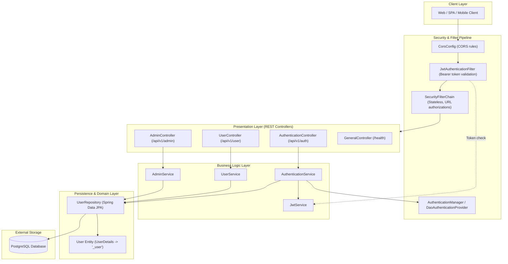
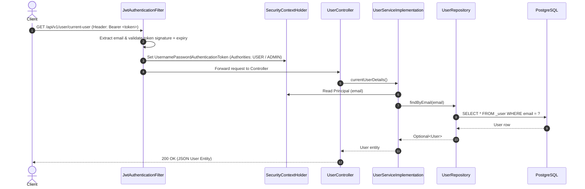

Viewed SKILL.md:1-64
Viewed antigravity-tools.md:1-24
Listed directory skill-management
Viewed README.md:1-64
Viewed pom.xml:1-88
Viewed application.properties:1-26
Listed directory src
Listed directory main
Listed directory resources
Listed directory java
Searched for "package"
Listed directory .mvn
Viewed .gitignore:1-34
Ran command: `git status; git remote -v; git log -n 5 --oneline`
Ran command: `git diff .gitignore`
Viewed UserManagementJavaSpringBootApplication.java:1-14
Viewed Role.java:1-7
Viewed User.java:1-69
Viewed UserRepository.java:1-15
Viewed ApplicationConfig.java:1-66
Viewed SecurityConfig.java:1-50
Viewed JwtAuthenticationFilter.java:1-81
Viewed AuthenticationRequest.java:1-19
Viewed AuthenticationResponse.java:1-17
Viewed RegisterRequest.java:1-23
Viewed CorsConfig.java:1-29
Viewed JwtService.java:1-22
Viewed JwtServiceImplementation.java:1-116
Viewed AuthenticationService.java:1-14
Viewed AuthenticationServiceImplementation.java:1-77
Viewed UserService.java:1-11
Viewed UserServiceImplementation.java:1-23
Viewed AdminService.java:1-13
Viewed AdminServiceImplementation.java:1-45
Viewed GeneralController.java:1-37
Viewed AuthenticationController.java:1-40
Viewed UserController.java:1-32
Viewed AdminController.java:1-42
Viewed UserManagementJavaSpringBootApplicationTests.java:1-14
Listed directory test
Listed directory java
Listed directory com
Listed directory alwinsimon
Listed directory target
Viewed maven-wrapper.properties:1-3
Viewed LICENSE:1-202
Ran command: `Get-ChildItem -Force`
Ran command: `java -version; mvn -version`
Ran command: `.\mvnw.cmd -version`

# Repository Analysis Report

## A. Repository Overview

- **Repository Identity & Remote**: The repository directory is `skill-management`, configured with git remote `origin` pointing to [`https://github.com/fur-elise-1867/skill-management.git`](https://github.com/fur-elise-1867/skill-management.git).
- **Core Domain & Purpose**: The project is a standalone Spring Boot REST API for user authentication and account management supporting two authorization roles (`USER` and `ADMIN`). The underlying codebase is based on Alwin Simon's open-source project [`User-Management-JavaSpringBoot`](https://github.com/alwinsimon/User-Management-JavaSpringBoot) under the Apache 2.0 license (see [LICENSE](file:///d:/Documents/Git%20Project/skill-management/LICENSE) and [README.md](file:///d:/Documents/Git%20Project/skill-management/README.md)).
- **Scope & Discrepancy**: Despite the workspace/repository folder name being `skill-management`, the code contains **no domain models, endpoints, schemas, or services relating to "skills" or "skill management"**. It solely implements basic user registration, JWT login, user profile lookup, and administrative user deletion.
- **Git & Worktree State**: The repository currently contains one commit (`b71259a Initial commit`). The Java source files, Maven wrapper, and configuration are untracked in the working tree, with only [.gitignore](file:///d:/Documents/Git%20Project/skill-management/.gitignore) carrying unstaged modifications. A precompiled binary build exists in [target/](file:///d:/Documents/Git%20Project/skill-management/target/).

---

## B. Technology Stack and Runtime Requirements

- **Language & Runtime**:
  - Configured Java Version: Java 17 ([pom.xml:L17](file:///d:/Documents/Git%20Project/skill-management/pom.xml#L17)).
  - Host Installed Java: Java 21 LTS (`21.0.7+8-LTS-245`).
- **Framework & Core Libraries**:
  - Spring Boot `3.2.0` ([pom.xml:L8](file:///d:/Documents/Git%20Project/skill-management/pom.xml#L8)).
  - Spring Web MVC (`spring-boot-starter-web`) running embedded Tomcat on default port `8080`.
  - Spring Security 6 (`spring-boot-starter-security`, `spring-security-test`).
  - Spring Data JPA (`spring-boot-starter-data-jpa`) backed by Hibernate 6.
  - Project Lombok (`org.projectlombok:lombok`) for annotation-driven boilerplate generation.
- **Database & Persistence**:
  - Driver: PostgreSQL JDBC Driver (`org.postgresql:postgresql`, runtime scope).
  - Dialect: `org.hibernate.dialect.PostgreSQLDialect` ([application.properties:L4](file:///d:/Documents/Git%20Project/skill-management/src/main/resources/application.properties#L4)).
  - Schema Strategy: `spring.jpa.hibernate.ddl-auto=update` with `spring.jpa.generate-ddl=true`. No migration framework (Flyway or Liquibase) is present.
  - Database URL: `jdbc:postgresql://localhost:5432/springbootusermanager` (hardcoded credentials: username `alwin`, password `123456` in [application.properties:L7-L13](file:///d:/Documents/Git%20Project/skill-management/src/main/resources/application.properties#L7-L13)).
- **Authentication & Cryptography**:
  - JSON Web Token (JJWT) `0.11.5`: `jjwt-api`, `jjwt-impl`, `jjwt-jackson` ([pom.xml:L48-L63](file:///d:/Documents/Git%20Project/skill-management/pom.xml#L48-L63)).
  - Hashing: `BCryptPasswordEncoder` for user password hashing ([ApplicationConfig.java:L33-L37](file:///d:/Documents/Git%20Project/skill-management/src/main/java/com/alwinsimon/UserManagementJavaSpringBoot/Config/ApplicationConfig.java#L33-L37)).
- **Build & Packaging**:
  - Maven 3.9.5 via wrapper scripts [mvnw](file:///d:/Documents/Git%20Project/skill-management/mvnw) and [mvnw.cmd](file:///d:/Documents/Git%20Project/skill-management/mvnw.cmd).
  - Note: `JAVA_HOME` is not set by default in the host environment, causing direct `./mvnw.cmd` invocation to require environment path setup.

---

## C. Directory and Module Map

```
skill-management/
├── .mvn/wrapper/                  # Maven wrapper binaries and configuration (maven-wrapper.properties)
├── src/
│   ├── main/
│   │   ├── java/com/alwinsimon/UserManagementJavaSpringBoot/
│   │   │   ├── UserManagementJavaSpringBootApplication.java # Application entry point (@SpringBootApplication)
│   │   │   ├── Config/            # Security, CORS, Authentication beans
│   │   │   │   ├── ApplicationConfig.java     # UserDetailsService, PasswordEncoder, AuthManager, Principal beans
│   │   │   │   ├── SecurityConfig.java        # SecurityFilterChain, CSRF, Session, Route rules
│   │   │   │   ├── Auth/                      # Request/response DTOs and CORS source
│   │   │   │   │   ├── AuthenticationRequest.java
│   │   │   │   │   ├── AuthenticationResponse.java
│   │   │   │   │   ├── CorsConfig.java        # Web CORS configuration source
│   │   │   │   │   └── RegisterRequest.java
│   │   │   │   └── Filter/
│   │   │   │       └── JwtAuthenticationFilter.java # OncePerRequestFilter for Bearer token validation
│   │   │   ├── Controller/        # REST endpoints
│   │   │   │   ├── AdminController.java       # Admin user management endpoints
│   │   │   │   ├── AuthenticationController.java # Registration and login endpoints
│   │   │   │   ├── GeneralController.java     # Health check endpoint
│   │   │   │   └── UserController.java        # Current user profile endpoint
│   │   │   ├── Model/             # JPA entities and enums
│   │   │   │   ├── Role.java                  # Role enum: USER, ADMIN
│   │   │   │   └── User.java                  # UserDetails entity mapped to '_user' table
│   │   │   ├── Repository/        # Spring Data JPA repositories
│   │   │   │   └── UserRepository.java        # JpaRepository<User, Long> with findByEmail
│   │   │   └── Service/           # Interfaces and business logic implementations
│   │   │       ├── AdminService.java
│   │   │       ├── AuthenticationService.java
│   │   │       ├── JwtService.java
│   │   │       ├── UserService.java
│   │   │       └── Implementation/
│   │   │           ├── AdminServiceImplementation.java
│   │   │           ├── AuthenticationServiceImplementation.java
│   │   │           ├── JwtServiceImplementation.java
│   │   │           └── UserServiceImplementation.java
│   │   └── resources/
│   │       └── application.properties         # Database and Hibernate runtime properties
│   └── test/
│       └── java/com/alwinsimon/SpringBootExp1/
│           └── UserManagementJavaSpringBootApplicationTests.java # Context loading test (mismatched package)
├── target/                        # Build output directory containing precompiled JAR and classes
├── .gitignore                     # Git ignore rules for Maven, IDEs, and build artifacts
├── LICENSE                        # Apache License 2.0
├── pom.xml                        # Maven project descriptor and dependencies
└── README.md                      # Upstream project overview and setup guide
```

---

## D. Architecture and Component Responsibilities



### Component Breakdown

1. **Presentation / Controller Layer**:
   - [AuthenticationController](file:///d:/Documents/Git%20Project/skill-management/src/main/java/com/alwinsimon/UserManagementJavaSpringBoot/Controller/AuthenticationController.java): Accepts registration and login payloads, returning signed JWT response tokens.
   - [UserController](file:///d:/Documents/Git%20Project/skill-management/src/main/java/com/alwinsimon/UserManagementJavaSpringBoot/Controller/UserController.java): Fetches current user profile from authenticated session.
   - [AdminController](file:///d:/Documents/Git%20Project/skill-management/src/main/java/com/alwinsimon/UserManagementJavaSpringBoot/Controller/AdminController.java): Restricted endpoint using `@Secured("ADMIN")` to list all users and delete users by email.
   - [GeneralController](file:///d:/Documents/Git%20Project/skill-management/src/main/java/com/alwinsimon/UserManagementJavaSpringBoot/Controller/GeneralController.java): Public health check endpoint returning server status and UTC timestamp.
2. **Security & Interception Layer**:
   - [SecurityConfig](file:///d:/Documents/Git%20Project/skill-management/src/main/java/com/alwinsimon/UserManagementJavaSpringBoot/Config/SecurityConfig.java): Configures stateless HTTP session policy, disables CSRF, attaches CORS configuration, whitelists `/health/` and `/api/v1/auth/**`, and registers `JwtAuthenticationFilter` before `UsernamePasswordAuthenticationFilter`.
   - [JwtAuthenticationFilter](file:///d:/Documents/Git%20Project/skill-management/src/main/java/com/alwinsimon/UserManagementJavaSpringBoot/Config/Filter/JwtAuthenticationFilter.java): Intercepts incoming requests, extracts Authorization header Bearer token, validates claims and expiration, and populates `SecurityContextHolder`.
   - [CorsConfig](file:///d:/Documents/Git%20Project/skill-management/src/main/java/com/alwinsimon/UserManagementJavaSpringBoot/Config/Auth/CorsConfig.java): Custom `CorsConfigurationSource` configuring allowed origins, headers, and credentials.
   - [ApplicationConfig](file:///d:/Documents/Git%20Project/skill-management/src/main/java/com/alwinsimon/UserManagementJavaSpringBoot/Config/ApplicationConfig.java): Declares Spring beans for `UserDetailsService` (email lookup), `PasswordEncoder` (BCrypt), `DaoAuthenticationProvider`, `AuthenticationManager`, and a dynamic `Principal` bean.
3. **Service Layer**:
   - [AuthenticationServiceImplementation](file:///d:/Documents/Git%20Project/skill-management/src/main/java/com/alwinsimon/UserManagementJavaSpringBoot/Service/Implementation/AuthenticationServiceImplementation.java): Handles user creation (forcing role to `USER`), password encryption, authentication delegation, and token generation.
   - [JwtServiceImplementation](file:///d:/Documents/Git%20Project/skill-management/src/main/java/com/alwinsimon/UserManagementJavaSpringBoot/Service/Implementation/JwtServiceImplementation.java): Manages HMAC-SHA256 signing key, claims extraction, token validity checks, and 24-hour expiration token generation.
   - [UserServiceImplementation](file:///d:/Documents/Git%20Project/skill-management/src/main/java/com/alwinsimon/UserManagementJavaSpringBoot/Service/Implementation/UserServiceImplementation.java): Resolves current user details from injected `Principal` via email.
   - [AdminServiceImplementation](file:///d:/Documents/Git%20Project/skill-management/src/main/java/com/alwinsimon/UserManagementJavaSpringBoot/Service/Implementation/AdminServiceImplementation.java): Queries all user records and executes deletion by email.
4. **Persistence Layer**:
   - [UserRepository](file:///d:/Documents/Git%20Project/skill-management/src/main/java/com/alwinsimon/UserManagementJavaSpringBoot/Repository/UserRepository.java): Spring Data JPA interface extending `JpaRepository<User, Long>` with `findByEmail(String email)`.
   - [User](file:///d:/Documents/Git%20Project/skill-management/src/main/java/com/alwinsimon/UserManagementJavaSpringBoot/Model/User.java): JPA Entity implementing Spring Security's `UserDetails`. Stored in table `_user` with unique constraint on `email`.

---

## E. Main Execution Flows



1. **Application Bootstrapping**:
   - `UserManagementJavaSpringBootApplication.main()` invokes `SpringApplication.run()` ([UserManagementJavaSpringBootApplication.java:L9-L11](file:///d:/Documents/Git%20Project/skill-management/src/main/java/com/alwinsimon/UserManagementJavaSpringBoot/UserManagementJavaSpringBootApplication.java#L9-L11)).
   - Hibernate connects to PostgreSQL (`springbootusermanager`), verifies connection, generates or updates the `_user` table schema.
   - Spring Security initializes security filter chains and registers `DaoAuthenticationProvider`.
2. **User Registration Flow**:
   - `POST /api/v1/auth/register` with body `{ name, gender, email, password }` ([AuthenticationController.java:L21-L28](file:///d:/Documents/Git%20Project/skill-management/src/main/java/com/alwinsimon/UserManagementJavaSpringBoot/Controller/AuthenticationController.java#L21-L28)).
   - `AuthenticationServiceImplementation.register()` encodes password via `BCryptPasswordEncoder`, sets `role = Role.USER`, and calls `userRepository.save(user)`.
   - `JwtServiceImplementation.generateJwtToken(user)` builds a 24-hour token signed with HMAC-SHA256.
   - Returns `{ "token": "..." }`.
3. **User Authentication Flow**:
   - `POST /api/v1/auth/authenticate` with body `{ email, password }` ([AuthenticationController.java:L30-L37](file:///d:/Documents/Git%20Project/skill-management/src/main/java/com/alwinsimon/UserManagementJavaSpringBoot/Controller/AuthenticationController.java#L30-L37)).
   - `authenticationManager.authenticate()` validates credentials against DB via `DaoAuthenticationProvider`.
   - `userRepository.findByEmail()` loads user entity.
   - `JwtServiceImplementation.generateJwtToken(user)` generates token and returns it.
4. **Authorized Request Execution (JWT Verification)**:
   - Client attaches `Authorization: Bearer <jwt>`.
   - `JwtAuthenticationFilter.doFilterInternal()` extracts token substring, decodes subject (email) via JJWT, loads `UserDetails` via `UserDetailsService`, checks token expiration, and assigns `UsernamePasswordAuthenticationToken` to `SecurityContextHolder`.
   - For `AdminController` endpoints, `@Secured("ADMIN")` checks `UserDetails.getAuthorities()` which returns `role.name()` (`"ADMIN"`).

---

## F. API, Data, and Integration Map

### 1. HTTP API Endpoints

| Method | Endpoint | Authorization | Request Body / Param | Success Response | Handled By |
| :--- | :--- | :--- | :--- | :--- | :--- |
| `GET` | `/health/` | Public | None | `200 OK` `{ data: { status, dateTime } }` | [GeneralController.java:L20](file:///d:/Documents/Git%20Project/skill-management/src/main/java/com/alwinsimon/UserManagementJavaSpringBoot/Controller/GeneralController.java#L20) |
| `POST` | `/api/v1/auth/register` | Public | `RegisterRequest` (JSON) | `200 OK` `{ token }` | [AuthenticationController.java:L21](file:///d:/Documents/Git%20Project/skill-management/src/main/java/com/alwinsimon/UserManagementJavaSpringBoot/Controller/AuthenticationController.java#L21) |
| `POST` | `/api/v1/auth/authenticate` | Public | `AuthenticationRequest` (JSON) | `200 OK` `{ token }` | [AuthenticationController.java:L30](file:///d:/Documents/Git%20Project/skill-management/src/main/java/com/alwinsimon/UserManagementJavaSpringBoot/Controller/AuthenticationController.java#L30) |
| `GET` | `/api/v1/user/current-user` | Authenticated (Any role) | None (Bearer header) | `200 OK` `User` (JSON entity) | [UserController.java:L21](file:///d:/Documents/Git%20Project/skill-management/src/main/java/com/alwinsimon/UserManagementJavaSpringBoot/Controller/UserController.java#L21) |
| `GET` | `/api/v1/admin/get-users` | `@Secured("ADMIN")` | None (Bearer header) | `200 OK` `List<User>` (JSON entities) | [AdminController.java:L21](file:///d:/Documents/Git%20Project/skill-management/src/main/java/com/alwinsimon/UserManagementJavaSpringBoot/Controller/AdminController.java#L21) |
| `DELETE` | `/api/v1/admin/delete-user/{email}` | `@Secured("ADMIN")` | PathVariable `email` | `200 OK` `"User deleted."` (or `404 NOT_FOUND`) | [AdminController.java:L31](file:///d:/Documents/Git%20Project/skill-management/src/main/java/com/alwinsimon/UserManagementJavaSpringBoot/Controller/AdminController.java#L31) |

### 2. Data Model (`_user` table)

- **Entity**: [User](file:///d:/Documents/Git%20Project/skill-management/src/main/java/com/alwinsimon/UserManagementJavaSpringBoot/Model/User.java#L21).
  - `id`: `Long`, Primary Key (`@Id`, `@GeneratedValue`).
  - `name`: `String`.
  - `gender`: `String`.
  - `email`: `String`, `@Column(unique = true)` and unique constraint on table `_user`.
  - `password`: `String` (BCrypt hash string).
  - `role`: `EnumType.STRING` (`USER` or `ADMIN`).
- **Table Name**: Mapped to `_user` ([User.java:L20](file:///d:/Documents/Git%20Project/skill-management/src/main/java/com/alwinsimon/UserManagementJavaSpringBoot/Model/User.java#L20)) because `user` is a reserved keyword in PostgreSQL.

### 3. Integrations & Background Workers

- **Database**: Single external integration with PostgreSQL over standard JDBC connection pool (HikariCP managed by Spring Boot).
- **Background Processes / Schedulers**: None. No `@Scheduled`, `@Async`, JMS, Kafka, RabbitMQ, or batch jobs exist in the project.

---

## G. Dependency Map and Critical Code Paths

### 1. Internal Dependency & Coupling Analysis

- **Concrete Class Injection**: [AuthenticationServiceImplementation.java:L23](file:///d:/Documents/Git%20Project/skill-management/src/main/java/com/alwinsimon/UserManagementJavaSpringBoot/Service/Implementation/AuthenticationServiceImplementation.java#L23) injects `JwtServiceImplementation` directly rather than depending on the `JwtService` interface.
- **Dynamic Principal Bean Anti-Pattern**: [ApplicationConfig.java:L60-L64](file:///d:/Documents/Git%20Project/skill-management/src/main/java/com/alwinsimon/UserManagementJavaSpringBoot/Config/ApplicationConfig.java#L60-L64) exposes a singleton bean returning `() -> SecurityContextHolder.getContext().getAuthentication().getName()`, which is directly injected into [UserServiceImplementation.java:L16](file:///d:/Documents/Git%20Project/skill-management/src/main/java/com/alwinsimon/UserManagementJavaSpringBoot/Service/Implementation/UserServiceImplementation.java#L16). If the security context has no authentication, invoking `principal.getName()` throws a `NullPointerException`.
- **Entity Leaks to Presentation**: [UserController.java:L22](file:///d:/Documents/Git%20Project/skill-management/src/main/java/com/alwinsimon/UserManagementJavaSpringBoot/Controller/UserController.java#L22) and [AdminController.java:L23](file:///d:/Documents/Git%20Project/skill-management/src/main/java/com/alwinsimon/UserManagementJavaSpringBoot/Controller/AdminController.java#L23) return the database entity `User` directly, causing Jackson to serialize the BCrypt password hash to JSON responses.

### 2. External Dependencies

- `spring-boot-starter-web` & `spring-boot-starter-security`: Provides MVC controllers, servlet filters, security context, and authentication managers.
- `spring-boot-starter-data-jpa`: Object-relational mapping via Hibernate and database repository abstraction.
- `postgresql`: JDBC runtime driver.
- `jjwt-api`, `jjwt-impl`, `jjwt-jackson` (`0.11.5`): Generates and parses HMAC signed JWT tokens.
- `lombok`: Generates `@Data`, `@Builder`, `@NoArgsConstructor`, `@AllArgsConstructor`, and `@RequiredArgsConstructor`.

---

## H. Test, Build, Deployment, and Operational Workflow

1. **Build Tooling**:
   - Standard Maven build via `pom.xml`.
   - Plugin: `spring-boot-maven-plugin` repackages the compiled classes into an executable fat JAR (`target/User-Management-JavaSpringBoot-0.0.1-SNAPSHOT.jar`).
2. **Testing Infrastructure**:
   - Dependencies: `spring-boot-starter-test` and `spring-security-test`.
   - Current Test Suite: Only contains a single test class: [UserManagementJavaSpringBootApplicationTests.java](file:///d:/Documents/Git%20Project/skill-management/src/test/java/com/alwinsimon/SpringBootExp1/UserManagementJavaSpringBootApplicationTests.java).
   - **Broken Test Package**: This test is placed under package `com.alwinsimon.SpringBootExp1`, while the main application class resides in `com.alwinsimon.UserManagementJavaSpringBoot`. Executing `mvn test` fails to locate the `@SpringBootApplication` context configuration.
   - No unit tests for services, filters, or controller endpoints exist.
3. **Deployment & CI/CD**:
   - No Dockerfile, `docker-compose.yml`, or container manifests exist.
   - No CI/CD pipelines (no `.github/workflows/`, GitLab CI, Jenkinsfile, etc.).
   - Deployment currently relies entirely on manual compilation and running the fat JAR with an active PostgreSQL instance.

---

## I. Risks, Ambiguities, Technical Debt, and Missing Documentation

### High Severity Risks & Defects

1. **Invalid CORS Configuration (Runtime Exception / Security Issue)**:
   - In [CorsConfig.java:L19-L21](file:///d:/Documents/Git%20Project/skill-management/src/main/java/com/alwinsimon/UserManagementJavaSpringBoot/Config/Auth/CorsConfig.java#L19-L21), `config.setAllowedOrigins(Collections.singletonList("*"))` is combined with `config.setAllowCredentials(true)`.
   - In Spring Security and the W3C CORS specification, combining wildcard origin (`*`) with `allowCredentials(true)` is invalid and causes Spring to throw an `IllegalArgumentException` on matching requests.
2. **Hardcoded JWT Secret Key in Source Code**:
   - In [JwtServiceImplementation.java:L22](file:///d:/Documents/Git%20Project/skill-management/src/main/java/com/alwinsimon/UserManagementJavaSpringBoot/Service/Implementation/JwtServiceImplementation.java#L22), the key `"2F66554775577754346D56726D7933315266773239773D3D"` is hardcoded as a static string instead of being read from external environment variables or encrypted secrets.
3. **Password Hash Leakage in API Responses**:
   - [UserController.java:L26](file:///d:/Documents/Git%20Project/skill-management/src/main/java/com/alwinsimon/UserManagementJavaSpringBoot/Controller/UserController.java#L26) and [AdminController.java:L27](file:///d:/Documents/Git%20Project/skill-management/src/main/java/com/alwinsimon/UserManagementJavaSpringBoot/Controller/AdminController.java#L27) return the raw `User` entity, which exposes the `password` field (the BCrypt hash) in the JSON response body.
4. **Hardcoded Database Credentials & Lack of Externalized Configuration**:
   - [application.properties:L7-L13](file:///d:/Documents/Git%20Project/skill-management/src/main/resources/application.properties#L7-L13) hardcodes local credentials (`alwin` / `123456`), preventing deployment across staging/production environments without file modification.
5. **Hibernate Auto DDL in Production Configuration**:
   - `spring.jpa.hibernate.ddl-auto=update` is used without database migration tools (Flyway/Liquibase). Schema changes are not version-controlled.

### Architectural & Code Quality Technical Debt

6. **Domain Discrepancy**: The repository is named `skill-management`, but contains no skill management domain models or logic.
2. **Broken Test Package Structure**: [UserManagementJavaSpringBootApplicationTests.java](file:///d:/Documents/Git%20Project/skill-management/src/test/java/com/alwinsimon/SpringBootExp1/UserManagementJavaSpringBootApplicationTests.java#L1) is under package `com.alwinsimon.SpringBootExp1`.
3. **Missing DTOs and Request Validation**:
   - [RegisterRequest.java](file:///d:/Documents/Git%20Project/skill-management/src/main/java/com/alwinsimon/UserManagementJavaSpringBoot/Config/Auth/RegisterRequest.java) and [AuthenticationRequest.java](file:///d:/Documents/Git%20Project/skill-management/src/main/java/com/alwinsimon/UserManagementJavaSpringBoot/Config/Auth/AuthenticationRequest.java) lack Jakarta validation annotations (`@NotBlank`, `@Email`, `@Size`).
   - Registration does not check for duplicate email before calling `save()`, resulting in unhandled `DataIntegrityViolationException`.
4. **Role Authority Inconsistency**:
   - [User.java:L36](file:///d:/Documents/Git%20Project/skill-management/src/main/java/com/alwinsimon/UserManagementJavaSpringBoot/Model/User.java#L36) produces authorities without `ROLE_` prefix (`"ADMIN"`, `"USER"`). While this works with `@Secured("ADMIN")`, standard Spring Security expressions like `hasRole("ADMIN")` fail unless prefixed with `ROLE_`.
5. **Lack of Global Exception Handling**:

- No `@RestControllerAdvice` exists. Exceptions result in inconsistent responses or default Spring error pages.
 1. **URL Mapping & Trailing Slash Matching**:

- [SecurityConfig.java:L36](file:///d:/Documents/Git%20Project/skill-management/src/main/java/com/alwinsimon/UserManagementJavaSpringBoot/Config/SecurityConfig.java#L36) whitelists `/health/` with a trailing slash, while standard Spring MVC 6 in Spring Boot 3 has strict trailing slash matching. Calling `/health` may be treated as unauthenticated.

---

## J. Recommended Reading Order for a New Engineer

1. [README.md](file:///d:/Documents/Git%20Project/skill-management/README.md) & [pom.xml](file:///d:/Documents/Git%20Project/skill-management/pom.xml): Review declared framework versions and dependencies.
2. [src/main/resources/application.properties](file:///d:/Documents/Git%20Project/skill-management/src/main/resources/application.properties): Review database and Hibernate connection settings.
3. [UserManagementJavaSpringBootApplication.java](file:///d:/Documents/Git%20Project/skill-management/src/main/java/com/alwinsimon/UserManagementJavaSpringBoot/UserManagementJavaSpringBootApplication.java): Main Spring Boot entry point.
4. [Model/Role.java](file:///d:/Documents/Git%20Project/skill-management/src/main/java/com/alwinsimon/UserManagementJavaSpringBoot/Model/Role.java) and [Model/User.java](file:///d:/Documents/Git%20Project/skill-management/src/main/java/com/alwinsimon/UserManagementJavaSpringBoot/Model/User.java): Inspect domain model and Spring Security `UserDetails` implementation.
5. [Repository/UserRepository.java](file:///d:/Documents/Git%20Project/skill-management/src/main/java/com/alwinsimon/UserManagementJavaSpringBoot/Repository/UserRepository.java): Review data access layer.
6. [Config/SecurityConfig.java](file:///d:/Documents/Git%20Project/skill-management/src/main/java/com/alwinsimon/UserManagementJavaSpringBoot/Config/SecurityConfig.java) & [Config/ApplicationConfig.java](file:///d:/Documents/Git%20Project/skill-management/src/main/java/com/alwinsimon/UserManagementJavaSpringBoot/Config/ApplicationConfig.java): Understand the security filter chain, beans, and authentication setup.
7. [Config/Filter/JwtAuthenticationFilter.java](file:///d:/Documents/Git%20Project/skill-management/src/main/java/com/alwinsimon/UserManagementJavaSpringBoot/Config/Filter/JwtAuthenticationFilter.java) & [Service/Implementation/JwtServiceImplementation.java](file:///d:/Documents/Git%20Project/skill-management/src/main/java/com/alwinsimon/UserManagementJavaSpringBoot/Service/Implementation/JwtServiceImplementation.java): Study token extraction, claims decoding, and validation.
8. [Service/Implementation/AuthenticationServiceImplementation.java](file:///d:/Documents/Git%20Project/skill-management/src/main/java/com/alwinsimon/UserManagementJavaSpringBoot/Service/Implementation/AuthenticationServiceImplementation.java) & [Controller/AuthenticationController.java](file:///d:/Documents/Git%20Project/skill-management/src/main/java/com/alwinsimon/UserManagementJavaSpringBoot/Controller/AuthenticationController.java): Examine authentication and registration flow.
9. [Controller/UserController.java](file:///d:/Documents/Git%20Project/skill-management/src/main/java/com/alwinsimon/UserManagementJavaSpringBoot/Controller/UserController.java) & [Controller/AdminController.java](file:///d:/Documents/Git%20Project/skill-management/src/main/java/com/alwinsimon/UserManagementJavaSpringBoot/Controller/AdminController.java): Review user and admin endpoints.

---

## K. Questions That Require Human Confirmation

1. **Project Identity & Scope**: Is this repository intended to be transformed into a **Skill Management System** (e.g. adding domain entities for Skills, Categories, Proficiencies, and User-Skill mappings), with the existing User Management serving as the authentication baseline, or is this repository solely maintaining User Management?
2. **Remediation of Existing Defects**: Should we first resolve the existing security and architectural defects (fixing the invalid CORS configuration, removing the password hash from API responses, externalizing the JWT secret and database credentials, and fixing the test suite package) before adding new functionality?
3. **Database Migration Strategy**: Do you want to introduce Flyway or Liquibase for versioned database schema migrations, or keep Hibernate `ddl-auto=update`?
4. **Environment & Containerization**: Would you like to introduce a `Dockerfile` and `docker-compose.yml` (including a PostgreSQL container) to simplify local development and testing?

---

### Inspection Scope and Boundary Declaration

- **Inspected**:
  - All 24 Java source files across `src/main/java` and `src/test/java`.
  - All configuration files: [pom.xml](file:///d:/Documents/Git%20Project/skill-management/pom.xml), [application.properties](file:///d:/Documents/Git%20Project/skill-management/src/main/resources/application.properties), [.mvn/wrapper/maven-wrapper.properties](file:///d:/Documents/Git%20Project/skill-management/.mvn/wrapper/maven-wrapper.properties), [.gitignore](file:///d:/Documents/Git%20Project/skill-management/.gitignore), [README.md](file:///d:/Documents/Git%20Project/skill-management/README.md), and [LICENSE](file:///d:/Documents/Git%20Project/skill-management/LICENSE).
  - Git repository metadata, commit history, branches, and remote configuration.
  - Host runtime environment capabilities (`java`, `mvn`, `JAVA_HOME`).
- **Deliberately Excluded**:
  - Binary and compiled build outputs in [target/](file:///d:/Documents/Git%20Project/skill-management/target/) (e.g., compiled `.class` files, `.jar` binaries, maven status files), because they are generated artifacts from previous builds and do not contain independent project source logic.

### Readiness Declaration

I have established a complete, evidence-based understanding of the architecture, security configuration, persistence layer, execution paths, and technical debt across this codebase. I have enough understanding to safely propose and evaluate changes.

Codebase analysis complete. Awaiting your next request.

Viewed README.md:47-64
