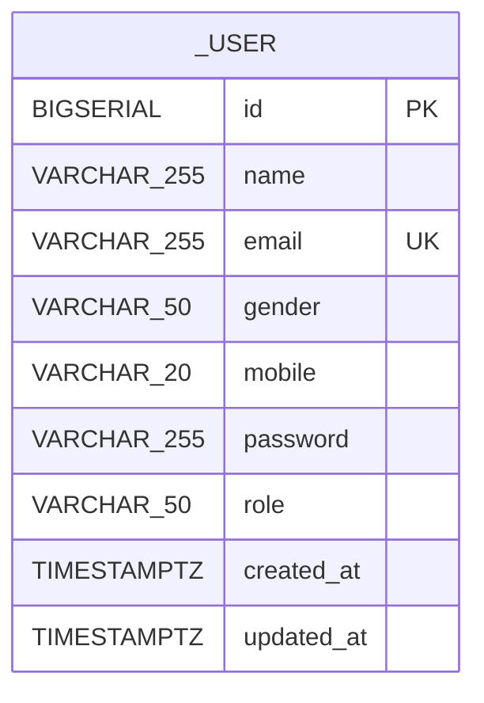
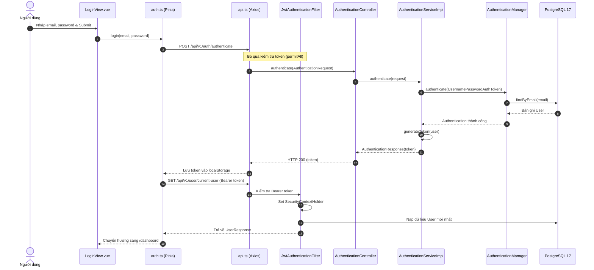
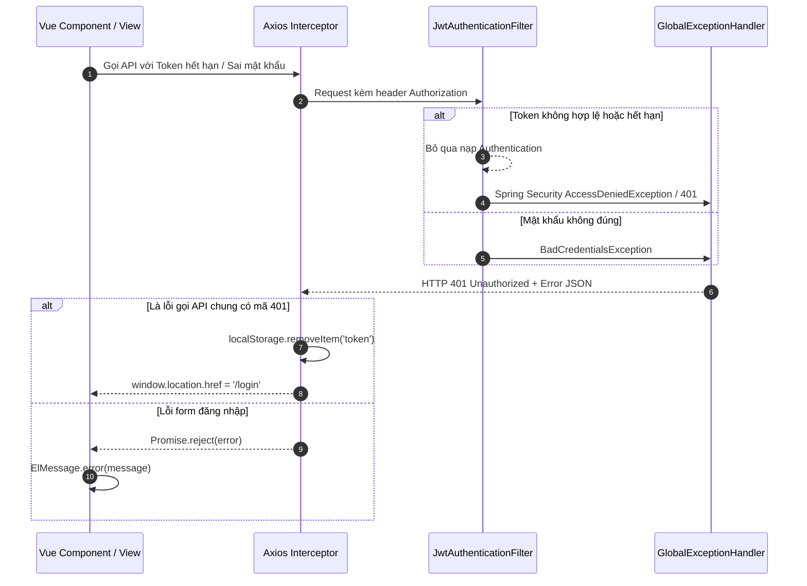
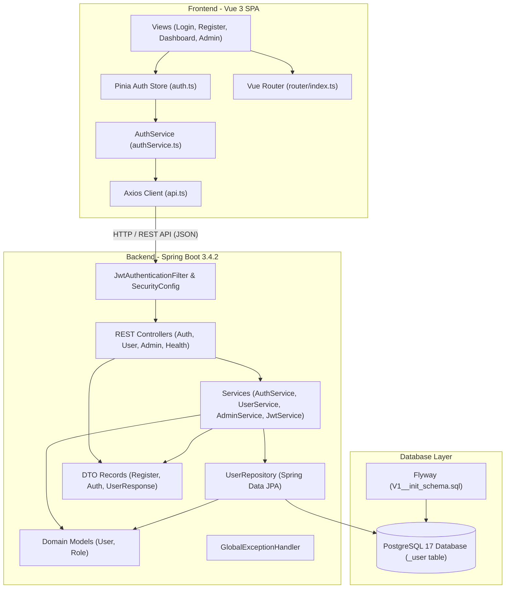

# AI Codebase Analysis

## 1. Executive Summary

- **System purpose (Mục đích hệ thống):**  
  Repository mang tên `skill-management` với mục tiêu định hướng là **Hệ thống Quản lý Kỹ năng (Skill Management System)**. Tuy nhiên, hiện trạng mã nguồn thực tế tại commit `81bf551` là một hệ thống **Quản lý người dùng, Xác thực JWT và Phân quyền (Authentication & User Profile Management System)** hoàn chỉnh theo kiến trúc Client-Server (Full-Stack Monorepo). Toàn bộ nghiệp vụ quản lý kỹ năng (skills, categories, matrix đánh giá, chứng chỉ) hiện **chưa được cài đặt** trong mã nguồn.
- **Primary business capabilities (Năng lực nghiệp vụ chính):**  
  1. *Đăng ký tài khoản người dùng* (`POST /api/v1/auth/register`) với mã hóa mật khẩu BCrypt và gán quyền mặc định `ROLE_USER`.  
  2. *Đăng nhập xác thực* (`POST /api/v1/auth/authenticate`) cấp phát JSON Web Token (JWT) định dạng HMAC-SHA256 với thời hạn 24 giờ.  
  3. *Truy xuất hồ sơ cá nhân* (`GET /api/v1/user/current-user`) dựa trên JWT Bearer token và SecurityContext.  
  4. *Quản trị người dùng (Admin-only)*: Xem toàn bộ danh sách người dùng (`GET /api/v1/admin/get-users`) và xóa người dùng theo email (`DELETE /api/v1/admin/delete-user/{email}`).  
  5. *Kiểm tra tình trạng sức khỏe hệ thống* (`GET /health` và Spring Boot Actuator endpoints).
- **Repository scope analyzed (Phạm vi phân tích mã nguồn):**  
  Toàn bộ repository bao gồm backend Java Spring Boot (`backend/`), frontend Vue 3 TypeScript (`frontend/`), cấu hình hạ tầng container (`docker-compose.yml`), các tài liệu gốc và cấu hình công cụ phát triển. Tổng cộng 67 tệp tin dự án đã được quét, nạp vào sơ đồ tri thức Understand Anything và phân tích chi tiết.
- **Technology stack (Ngăn xếp công nghệ):**  
  - Backend: Java 21 LTS (Virtual Threads), Spring Boot 3.4.2, Spring Security 6, Spring Data JPA, Hibernate 6, Flyway, JJWT 0.12.6, Maven Wrapper.  
  - Frontend: Vue 3.5.40 (Composition API, `<script setup>`), TypeScript 6, Vite 8.1.5, Pinia 4.0.2, Vue Router 5.2.0, Element Plus 2.14.5, Axios 1.20.0, Vitest 4.1.10.  
  - Database: PostgreSQL 17 Alpine via Docker Compose.
- **Overall architectural style (Kiến trúc tổng thể):**  
  Kiến trúc phân tầng truyền thống (N-Tier Layered Architecture) phía Backend kết hợp Single Page Application (SPA) phản ứng (reactive) phía Frontend, giao tiếp phi trạng thái (stateless) qua RESTful API chuẩn JSON với cơ chế xác thực JWT Bearer Token.
- **Analysis timestamp (Thời điểm phân tích):**  
  2026-09-05T17:15:00+07:00 (Cam kết Git: `81bf5513894456b990b780efb6343e22b2258951` trên nhánh `dev`).

---

## 2. Analysis Scope and Method

- **Understand Anything knowledge-graph status:**  
  Sơ đồ tri thức Understand Anything đã được xây dựng hoàn chỉnh tại thư mục `.ua/`. Bao gồm:
  - `67` tệp tin dự án được lập chỉ mục dấu vân tay cấu trúc (`.ua/fingerprints.json`).
  - `88` nút thực thể (node) thuộc 7 nhóm phân loại (`file`, `class`, `table`, `endpoint`, `config`, `document`, `service`).
  - `35` cạnh quan hệ (edge) ngữ nghĩa (`imports`, `contains`, `serves`, `tested_by`, v.v.).
  - `7` phân tầng kiến trúc (`layers`) và lộ trình dẫn dắt mã nguồn (`tour`) gồm 7 chặng học tập.
  - Tệp metadata hợp lệ: `.ua/meta.json` tham chiếu commit `81bf5513894456b990b780efb6343e22b2258951`.
- **Inspected areas (Khu vực kiểm tra thực tế):**  
  - Toàn bộ 21 tệp mã nguồn Java backend (`backend/src/main/java/**`), tệp test (`backend/src/test/**`), cấu hình Maven (`pom.xml`), cấu hình ứng dụng (`application.yml`, `application-test.yml`), và migration Flyway (`V1__init_schema.sql`).
  - Toàn bộ mã nguồn Vue 3 và TypeScript frontend (`frontend/src/**`), các tệp cấu hình Vite, Vitest, TypeScript, ESLint, Oxlint, Prettier và `package.json`.
  - Tệp điều phối vùng chứa `docker-compose.yml`, các tài liệu Markdown (`README.md`, `CODEBASE_ANALYSIS.md`, `CODEBASE_ANALYSIS_01.md`, `LICENSE`), và quy tắc `.gitignore`.
- **Excluded areas and reasons (Khu vực loại trừ và lý do):**  
  - `frontend/node_modules/`: Thư viện phụ thuộc bên thứ ba của Node.js (được quản lý tự động qua `package.json`).
  - `frontend/package-lock.json`: Tệp khóa phiên bản gói (lockfile) kích thước lớn (~6.800 dòng), không chứa logic ứng dụng.
  - `backend/target/`: Thư mục chứa artifact biên dịch nhị phân `.class` và `.jar`.
  - `.git/`: Siêu dữ liệu phiên bản nội bộ của Git.
  - `.idea/`: Tệp cấu hình workspace của IntelliJ IDEA.
- **Important limitations (Giới hạn phân tích quan trọng):**  
  - Phân tích được thực hiện hoàn toàn ở chế độ tĩnh (static, read-only analysis) dựa trên mã nguồn trong repository.
  - Không có phiên bản PostgreSQL đang chạy thực tế tại runtime để kiểm tra hành vi kết nối mạng, locking, hoặc hiệu năng truy vấn dưới tải.
- **Verified facts versus inferences (Phân định sự thật được xác minh và suy luận):**  
  - *Verified (Đã xác minh 100% qua mã nguồn):* Các endpoints REST, mô hình thực thể JPA, các trường dữ liệu DTO, cơ chế mã hóa mật khẩu, các bộ lọc Spring Security, cấu hình CORS, bảng cơ sở dữ liệu `_user`, các routes Vue Router, và Pinia auth store.
  - *Inferred (Suy luận có căn cứ):* Cấu trúc repository bắt nguồn từ việc refactor dự án open-source `User-Management-JavaSpringBoot` thành kiến trúc decoupled backend/frontend nhằm chuẩn bị nền tảng danh tính (identity/user foundation) trước khi xây dựng phân hệ quản lý kỹ năng (skills).
  - *Not verified at runtime (Chưa kiểm chứng runtime):* Thời gian phản hồi thực tế của PostgreSQL 17 dưới tải, hành vi của connection pool HikariCP khi chịu tải đồng thời với Java 21 Virtual Threads, và tính tương thích của Flyway migration trên cluster database có phân vùng.

---

## 3. Repository Structure

### Directory tree summary
```
skill-management/
├── .gitignore
├── .ua/                                   # Understand Anything knowledge graph metadata
│   ├── fingerprints.json
│   ├── knowledge-graph.json
│   ├── meta.json
│   └── intermediate/scan-result.json
├── CODEBASE_ANALYSIS.md                   # Tài liệu phân tích hiện trạng cũ
├── CODEBASE_ANALYSIS_01.md                # Tài liệu kiểm toán bước chuyển tiếp cũ
├── docker-compose.yml                     # Cấu hình container PostgreSQL 17 Alpine
├── docs/
│   └── AI_CODEBASE_ANALYSIS.md            # Báo cáo phân tích toàn diện (tệp này)
├── LICENSE                                # Apache License 2.0
├── README.md                              # Hướng dẫn khởi chạy & đặc tả tổng quan
├── backend/                               # Phân hệ Spring Boot 3.4.2 API
│   ├── pom.xml                            # Quản lý dependency Maven
│   ├── mvnw / mvnw.cmd                    # Maven Wrapper script
│   ├── .mvn/wrapper/                      # Maven Wrapper binary & properties
│   └── src/
│       ├── main/
│       │   ├── java/com/furelise/skillmanagement/
│       │   │   ├── SkillManagementApplication.java
│       │   │   ├── config/                # Cấu hình Security, CORS, Beans & JWT filter
│       │   │   ├── controller/            # REST Controllers (Auth, User, Admin, Health)
│       │   │   ├── dto/                   # Java 21 Records (Request/Response)
│       │   │   ├── exception/             # Global exception handler (@RestControllerAdvice)
│       │   │   ├── model/                 # JPA Entity (User) & Enum (Role)
│       │   │   ├── repository/            # Spring Data JPA Repository (UserRepository)
│       │   │   └── service/               # Interfaces & Implementations nghiệp vụ
│       │   └── resources/
│       │       ├── application.yml        # Cấu hình chính của ứng dụng backend
│       │       └── db/migration/          # Script Flyway migration (V1__init_schema.sql)
│       └── test/
│           ├── java/com/furelise/skillmanagement/SkillManagementApplicationTests.java
│           └── resources/application-test.yml
└── frontend/                              # Phân hệ Vue 3 SPA
    ├── package.json                       # Dependencies & scripts
    ├── vite.config.ts                     # Cấu hình Vite dev server & proxy
    ├── vitest.config.ts                   # Cấu hình kiểm thử đơn vị frontend
    ├── tsconfig*.json                     # Cấu hình TypeScript compiler
    ├── eslint.config.ts / .oxlintrc.json  # Bộ quy tắc linting
    └── src/
        ├── App.vue                        # Root component chứa <RouterView />
        ├── main.ts                        # Bootstrap Pinia, Router, Element Plus
        ├── assets/main.css                # CSS toàn cục
        ├── router/index.ts                # Vue Router & Navigation Guards
        ├── services/                      # Axios client & Auth API wrapper
        ├── stores/                        # Pinia Auth store & Unit test
        ├── types/index.ts                 # TypeScript type definitions
        └── views/                         # Trang giao diện (Login, Register, Dashboard, Admin)
```

### Module map & Responsibility of each major module

| Module | Đường dẫn tương đối | Trách nhiệm chính |
|:---|:---|:---|
| **Root Orchestration** | `/`, `docker-compose.yml` | Khởi động môi trường cơ sở dữ liệu dùng chung (PostgreSQL 17), quy định gitignore, bản quyền và tài liệu hệ thống. |
| **Backend Core** | `backend/` | Cung cấp RESTful API xử lý đăng ký, đăng nhập, mã hóa mật khẩu, sinh/giải mã JWT, bảo vệ tài nguyên theo vai trò (`ROLE_USER`, `ROLE_ADMIN`), kết nối database qua JPA và quản lý phiên bản lược đồ qua Flyway. |
| **Frontend Client** | `frontend/` | Cung cấp giao diện người dùng SPA (Single Page Application), định tuyến có bảo vệ quyền hạn, lưu trữ token client-side, tương tác HTTP qua Axios và hiển thị bảng biểu/form bằng Element Plus. |

### Recommended reading order for a new engineer (Thứ tự đọc mã nguồn khuyến nghị)
1. [`README.md`](file:///d:/Documents/Git%20Project/skill-management/README.md): Nắm bức tranh tổng quan, kiến trúc và lệnh khởi chạy cục bộ.
2. [`docker-compose.yml`](file:///d:/Documents/Git%20Project/skill-management/docker-compose.yml) & [`V1__init_schema.sql`](file:///d:/Documents/Git%20Project/skill-management/backend/src/main/resources/db/migration/V1__init_schema.sql): Hiểu cấu trúc bảng cơ sở dữ liệu `_user`.
3. [`backend/src/main/resources/application.yml`](file:///d:/Documents/Git%20Project/skill-management/backend/src/main/resources/application.yml): Xem các tham số runtime, cổng, datasource, virtual threads và khóa bí mật JWT.
4. [`User.java`](file:///d:/Documents/Git%20Project/skill-management/backend/src/main/java/com/furelise/skillmanagement/model/User.java) & [`Role.java`](file:///d:/Documents/Git%20Project/skill-management/backend/src/main/java/com/furelise/skillmanagement/model/Role.java): Hiểu mô hình thực thể và ánh xạ thẩm quyền của Spring Security.
5. [`SecurityConfig.java`](file:///d:/Documents/Git%20Project/skill-management/backend/src/main/java/com/furelise/skillmanagement/config/SecurityConfig.java) & [`JwtAuthenticationFilter.java`](file:///d:/Documents/Git%20Project/skill-management/backend/src/main/java/com/furelise/skillmanagement/config/filter/JwtAuthenticationFilter.java): Nắm luồng chặn và thẩm định yêu cầu HTTP.
6. [`AuthenticationController.java`](file:///d:/Documents/Git%20Project/skill-management/backend/src/main/java/com/furelise/skillmanagement/controller/AuthenticationController.java), [`UserController.java`](file:///d:/Documents/Git%20Project/skill-management/backend/src/main/java/com/furelise/skillmanagement/controller/UserController.java), [`AdminController.java`](file:///d:/Documents/Git%20Project/skill-management/backend/src/main/java/com/furelise/skillmanagement/controller/AdminController.java) và các Service tương ứng.
7. [`frontend/src/router/index.ts`](file:///d:/Documents/Git%20Project/skill-management/frontend/src/router/index.ts) & [`frontend/src/stores/auth.ts`](file:///d:/Documents/Git%20Project/skill-management/frontend/src/stores/auth.ts): Xem logic định tuyến và quản lý trạng thái token ở client.
8. [`frontend/src/views/`](file:///d:/Documents/Git%20Project/skill-management/frontend/src/views/): Xem cách hiển thị và xử lý sự kiện người dùng trên giao diện.

---

## 4. Technology Stack and Local Setup

### Java 21 and Spring Boot stack
- **Java Platform:** Java 21 LTS (sử dụng các tính năng hiện đại: Java Records cho DTO, Virtual Threads cho Web Server, Pattern Matching for instanceof).
- **Spring Framework:** Spring Boot 3.4.2 (Spring Framework 6.2.x).
- **Spring Security:** Phiên bản 6.4.x với cấu hình Lambda DSL (`authorizeHttpRequests`, `sessionManagement`), phương thức bảo vệ bằng `@Secured` và `@EnableMethodSecurity`.
- **Thư viện xác thực token:** JJWT (`io.jsonwebtoken:jjwt-api:0.12.6`, runtime: `jjwt-impl`, `jjwt-jackson`).
- **ORM / Persistence:** Spring Data JPA, Hibernate 6.6.x, PostgreSQL JDBC Driver (`org.postgresql:postgresql:42.7.5`).
- **Migration:** Flyway (`flyway-core:10.20.1` và `flyway-database-postgresql`).
- **Annotation Processing:** Lombok (`org.projectlombok:lombok`) chỉ áp dụng cho entity JPA [`User.java`](file:///d:/Documents/Git%20Project/skill-management/backend/src/main/java/com/furelise/skillmanagement/model/User.java). Toàn bộ DTO đều dùng Java Records thuần túy.

### Vue stack
- **Core Framework:** Vue 3.5.40 sử dụng Composition API và `<script setup lang="ts">`.
- **Language:** TypeScript ~6.0.0 (`vue-tsc` 3.3.7).
- **Build Tool & Bundler:** Vite 8.1.5 với các plugin:
  - `@vitejs/plugin-vue`: Biên dịch SFC (Single File Component).
  - `vite-plugin-vue-devtools`: Công cụ gỡ lỗi Vue DevTools.
  - `unplugin-auto-import` & `unplugin-vue-components`: Tự động nạp components và APIs của Element Plus.
- **State Management:** Pinia 4.0.2 thiết kế theo cú pháp Setup Store.
- **Routing:** Vue Router 5.2.0 (sử dụng `createRouter` và `createWebHistory`).
- **UI Component Library:** Element Plus 2.14.5 kèm `@element-plus/icons-vue:2.3.2`.
- **HTTP Client:** Axios 1.20.0 với Request và Response Interceptors.
- **Testing & Quality Tools:** Vitest 4.1.10, `@vue/test-utils` 2.4.11, Oxlint 1.74.0, ESLint 10.7.0, Prettier 3.9.5.

### PostgreSQL 17 stack
- **PostgreSQL Version:** PostgreSQL 17 Alpine chạy trên container Docker `skill-mgmt-postgres`.
- **Port:** 5432.
- **Database Name:** `skill_management_db`.
- **Default Credentials:** Username `postgres`, Password `postgres` (có thể ghi đè qua biến môi trường `DB_USERNAME`, `DB_PASSWORD`).
- **Volume:** `pgdata` mount vào `/var/lib/postgresql/data` đảm bảo dữ liệu bền vững (persistent).

### Build/package tools & Required runtime dependencies
- Node.js version yêu cầu: `^22.18.0 || >=24.12.0`.
- Java Development Kit: JDK 21 trở lên.
- Maven Wrapper: Đã đóng gói sẵn `mvnw` (Linux/macOS) và `mvnw.cmd` (Windows).
- Docker Engine & Docker Compose CLI v2.

### Local run, test, build, and debugging commands

| Mục đích | Thư mục thực thi | Lệnh (Windows / PowerShell) | Lệnh (Linux / macOS) |
|:---|:---|:---|:---|
| **1. Khởi động PostgreSQL** | Thư mục gốc (`/`) | `docker compose up -d` | `docker compose up -d` |
| **2. Tắt PostgreSQL** | Thư mục gốc (`/`) | `docker compose down` | `docker compose down` |
| **3. Chạy Backend dev** | `backend/` | `.\mvnw.cmd spring-boot:run` | `./mvnw spring-boot:run` |
| **4. Build Backend JAR** | `backend/` | `.\mvnw.cmd clean package -DskipTests` | `./mvnw clean package -DskipTests` |
| **5. Chạy Backend test** | `backend/` | `.\mvnw.cmd test` | `./mvnw test` |
| **6. Cài đặt Frontend** | `frontend/` | `npm install` hoặc `pnpm.cmd install` | `npm install` |
| **7. Chạy Frontend dev** | `frontend/` | `npm run dev` | `npm run dev` |
| **8. Kiểm tra type Frontend** | `frontend/` | `npm run type-check` | `npm run type-check` |
| **9. Chạy Frontend test** | `frontend/` | `npm run test:unit` | `npm run test:unit` |
| **10. Build Frontend dist**| `frontend/` | `npm run build` | `npm run build` |
| **11. Lint Frontend** | `frontend/` | `npm run lint` | `npm run lint` |

---

## 5. Backend Architecture

### Application entry points
- Lớp khởi động chính: [`SkillManagementApplication`](file:///d:/Documents/Git%20Project/skill-management/backend/src/main/java/com/furelise/skillmanagement/SkillManagementApplication.java) được chú thích `@SpringBootApplication`.
- Phương thức `public static void main(String[] args)` khởi chạy Spring Container thông qua `SpringApplication.run(SkillManagementApplication.class, args)`.
- Component scanning mặc định quét đệ quy toàn bộ gói con bên dưới `com.furelise.skillmanagement`.

### Package/module architecture
```
com.furelise.skillmanagement/
├── config/              # Hạ tầng Spring: SecurityConfig, CorsConfig, ApplicationConfig
│   └── filter/          # Servlet Filter: JwtAuthenticationFilter
├── controller/          # Tầng giao diện REST: AuthenticationController, UserController, AdminController, HealthController
├── dto/                 # Data Transfer Objects: Java Records
├── exception/           # Xử lý lỗi tập trung: GlobalExceptionHandler
├── model/               # Miền thực thể: User (Entity), Role (Enum)
├── repository/          # Tầng truy xuất dữ liệu: UserRepository (Spring Data JPA)
└── service/             # Tầng hợp đồng nghiệp vụ (Interfaces)
    └── impl/            # Cài đặt chi tiết nghiệp vụ (Implementations)
```

### API layer
- Được xây dựng trên nền tảng Spring MVC (`@RestController`, `@RequestMapping`).
- DTO (Request/Response) sử dụng tính năng bất biến (immutability) của Java 21 Records:
  - [`RegisterRequest`](file:///d:/Documents/Git%20Project/skill-management/backend/src/main/java/com/furelise/skillmanagement/dto/RegisterRequest.java): Chứa `@NotBlank`, `@Email`, `@Size(min = 8)`.
  - [`AuthenticationRequest`](file:///d:/Documents/Git%20Project/skill-management/backend/src/main/java/com/furelise/skillmanagement/dto/AuthenticationRequest.java): Chứa `@NotBlank`, `@Email`.
  - [`AuthenticationResponse`](file:///d:/Documents/Git%20Project/skill-management/backend/src/main/java/com/furelise/skillmanagement/dto/AuthenticationResponse.java): Trả về `token`.
  - [`UserResponse`](file:///d:/Documents/Git%20Project/skill-management/backend/src/main/java/com/furelise/skillmanagement/dto/UserResponse.java): Chứa thông tin hồ sơ người dùng đầy đủ nhưng loại bỏ hoàn toàn trường nhạy cảm `password`. Có static factory method `from(User user)`.
- Hiện tại dự án **chưa tích hợp Swagger/OpenAPI** (không có dependency `springdoc-openapi-starter-webmvc-ui` trong `pom.xml`).
- Chưa áp dụng phiên bản API động (URL versioning cứng tại `/api/v1/...`).

### Business/domain/service layer
- Tách biệt rõ ràng giữa interface và implementation:
  - [`AuthenticationService`](file:///d:/Documents/Git%20Project/skill-management/backend/src/main/java/com/furelise/skillmanagement/service/AuthenticationService.java) / [`AuthenticationServiceImpl`](file:///d:/Documents/Git%20Project/skill-management/backend/src/main/java/com/furelise/skillmanagement/service/impl/AuthenticationServiceImpl.java): Kiểm tra email trùng lặp, mã hóa mật khẩu bằng BCrypt, lưu User, gọi `JwtService.generateToken()`.
  - [`UserService`](file:///d:/Documents/Git%20Project/skill-management/backend/src/main/java/com/furelise/skillmanagement/service/UserService.java) / [`UserServiceImpl`](file:///d:/Documents/Git%20Project/skill-management/backend/src/main/java/com/furelise/skillmanagement/service/impl/UserServiceImpl.java): Trích xuất danh tính từ `SecurityContextHolder.getContext().getAuthentication().getPrincipal()`, truy vấn dữ liệu mới nhất từ database và chuyển đổi thành `UserResponse`.
  - [`AdminService`](file:///d:/Documents/Git%20Project/skill-management/backend/src/main/java/com/furelise/skillmanagement/service/AdminService.java) / [`AdminServiceImpl`](file:///d:/Documents/Git%20Project/skill-management/backend/src/main/java/com/furelise/skillmanagement/service/impl/AdminServiceImpl.java): Liệt kê toàn bộ người dùng qua `userRepository.findAll()` và xóa người dùng qua `userRepository.deleteById(user.getId())`.
  - [`JwtService`](file:///d:/Documents/Git%20Project/skill-management/backend/src/main/java/com/furelise/skillmanagement/service/JwtService.java) / [`JwtServiceImpl`](file:///d:/Documents/Git%20Project/skill-management/backend/src/main/java/com/furelise/skillmanagement/service/impl/JwtServiceImpl.java): Xử lý token parsing, claim extraction, signing và verification.
- Ranh giới giao dịch (Transactional boundaries):
  - Phương thức [`AdminServiceImpl.deleteUserByEmail`](file:///d:/Documents/Git%20Project/skill-management/backend/src/main/java/com/furelise/skillmanagement/service/impl/AdminServiceImpl.java#L32) được chú thích `@Transactional`.
  - Phương thức [`AuthenticationServiceImpl.register`](file:///d:/Documents/Git%20Project/skill-management/backend/src/main/java/com/furelise/skillmanagement/service/impl/AuthenticationServiceImpl.java#L31) **chưa có chú thích `@Transactional`**.

### Persistence layer
- Kế thừa `JpaRepository<User, Long>` trong [`UserRepository`](file:///d:/Documents/Git%20Project/skill-management/backend/src/main/java/com/furelise/skillmanagement/repository/UserRepository.java).
- Cung cấp 2 derived queries: `Optional<User> findByEmail(String email)` và `void deleteByEmail(String email)`.
- Hibernate 6 đóng vai trò JPA Provider. Cấu hình `spring.jpa.hibernate.ddl-auto: validate` buộc schema phải khớp chính xác với kết quả migration của Flyway.

### Security model
- **Authentication Flow:** Stateless JWT Authentication.
- **Filter Chain:**
  1. `CorsFilter` (được cấu hình qua `CorsConfig.corsConfigurationSource()`).
  2. `CsrfConfigurer.disable()` (vô hiệu hóa CSRF vì hệ thống API là stateless).
  3. `JwtAuthenticationFilter`: Chặn trước `UsernamePasswordAuthenticationFilter`.
- **Bảo mật cấp phương thức (Method Security):** Kích hoạt `@EnableMethodSecurity(securedEnabled = true, prePostEnabled = true)`. Các API nhạy cảm của Admin được bảo vệ bằng `@Secured("ROLE_ADMIN")`.
- **CORS:** Cho phép các nguồn gốc từ biến `cors.allowed-origins` (mặc định `http://localhost:5173`), hỗ trợ đầy đủ các method `GET`, `POST`, `PUT`, `DELETE`, `OPTIONS`, `PATCH`, header `Authorization` và `allowCredentials: true`.

### Configuration profiles
- Profile mặc định (`application.yml`): Kết nối `jdbc:postgresql://localhost:5432/skill_management_db`, kích hoạt Flyway và Virtual Threads.
- Profile kiểm thử `test` ([`application-test.yml`](file:///d:/Documents/Git%20Project/skill-management/backend/src/test/resources/application-test.yml)): Trỏ tới database `skill_management_test_db`, đặt `ddl-auto: create-drop`, vô hiệu hóa Flyway (`flyway.enabled: false`) và dùng secret key giả lập.

### Async/scheduling/messaging
- `spring.threads.virtual.enabled: true`: Bật cơ chế Java 21 Virtual Threads cho Tomcat servlet container. Mọi yêu cầu HTTP đến sẽ được xử lý trên một virtual thread riêng biệt mà không bị tắc nghẽn OS thread.
- Hệ thống hiện **chưa sử dụng** `@Async`, `@Scheduled`, Message Broker (Kafka/RabbitMQ) hay WebSocket.

### Integrations
- Tích hợp duy nhất là với máy chủ cơ sở dữ liệu PostgreSQL qua JDBC.
- Không có tích hợp bên thứ ba (email SMTP, S3 storage, thanh toán, OAuth2 provider).

### Observability and error handling
- **Actuator:** Kích hoạt endpoints `/actuator/health` và `/actuator/info`.
- **Custom Health Endpoint:** [`HealthController`](file:///d:/Documents/Git%20Project/skill-management/backend/src/main/java/com/furelise/skillmanagement/controller/HealthController.java) cung cấp `/health` trả về JSON `{"status": "UP", "timestamp": "...", "application": "skill-management"}`.
- **Global Error Handling:** [`GlobalExceptionHandler`](file:///d:/Documents/Git%20Project/skill-management/backend/src/main/java/com/furelise/skillmanagement/exception/GlobalExceptionHandler.java) chuẩn hóa định dạng phản hồi lỗi:
  ```json
  {
    "timestamp": "2026-09-05T10:15:00Z",
    "status": 400,
    "error": "Bad Request",
    "message": "Chi tiết thông báo",
    "details": { "field": "lý do lỗi validation" }
  }
  ```

---

## 6. Frontend Architecture

### Application bootstrap
- Điểm khởi chạy: [`frontend/src/main.ts`](file:///d:/Documents/Git%20Project/skill-management/frontend/src/main.ts).
- Khởi tạo ứng dụng Vue bằng `createApp(App)`.
- Đăng ký toàn bộ biểu tượng từ `@element-plus/icons-vue` vào global component registry.
- Kích hoạt Pinia store (`app.use(createPinia())`), Vue Router (`app.use(router)`), và Element Plus (`app.use(ElementPlus)`).
- Nạp CSS của Element Plus (`element-plus/dist/index.css`) và CSS tùy biến [`src/assets/main.css`](file:///d:/Documents/Git%20Project/skill-management/frontend/src/assets/main.css).
- Mount vào phần tử DOM `#app` trong [`index.html`](file:///d:/Documents/Git%20Project/skill-management/frontend/index.html).

### Routing and route guards
- Định tuyến khai báo tại [`frontend/src/router/index.ts`](file:///d:/Documents/Git%20Project/skill-management/frontend/src/router/index.ts):
  - `/` -> Redirect sang `/login`.
  - `/login` -> [`LoginView.vue`](file:///d:/Documents/Git%20Project/skill-management/frontend/src/views/LoginView.vue) (`meta: { requiresGuest: true }`).
  - `/register` -> [`RegisterView.vue`](file:///d:/Documents/Git%20Project/skill-management/frontend/src/views/RegisterView.vue) (`meta: { requiresGuest: true }`).
  - `/dashboard` -> [`DashboardView.vue`](file:///d:/Documents/Git%20Project/skill-management/frontend/src/views/DashboardView.vue) (`meta: { requiresAuth: true }`).
  - `/admin` -> [`AdminView.vue`](file:///d:/Documents/Git%20Project/skill-management/frontend/src/views/AdminView.vue) (`meta: { requiresAuth: true, requiresAdmin: true }`).
- **Global Navigation Guard (`router.beforeEach`):**
  1. Kiểm tra nếu đã có token trong store nhưng chưa có thông tin user, kích hoạt hàm `auth.fetchCurrentUser()`.
  2. Nếu route yêu cầu `requiresAuth` mà chưa đăng nhập (`!auth.isAuthenticated`) -> Điều hướng về `/login`.
  3. Nếu route yêu cầu `requiresGuest` (login, register) mà đã đăng nhập -> Điều hướng về `/dashboard`.
  4. Nếu route yêu cầu `requiresAdmin` mà `!auth.isAdmin` -> Điều hướng về `/dashboard`.

### Page/component structure
- **Root Component:** [`App.vue`](file:///d:/Documents/Git%20Project/skill-management/frontend/src/App.vue) đóng vai trò container chứa thẻ `<RouterView />`.
- **Views:**
  - `LoginView.vue`: Card đăng nhập bo góc với hiệu ứng blur `backdrop-filter`, form email/password, thông báo qua `ElMessage`.
  - `RegisterView.vue`: Form đăng ký có kiểm tra bắt buộc, dropdown chọn giới tính (`Male`, `Female`, `Other`), trường nhập số điện thoại.
  - `DashboardView.vue`: Header chào mừng, thẻ hiển thị vai trò (Tag đỏ cho ADMIN, xanh cho USER), nút chuyển tới trang Quản trị, và bảng chi tiết hồ sơ `el-descriptions` (ID, họ tên, email, giới tính, SĐT, vai trò, ngày tạo, ngày cập nhật).
  - `AdminView.vue`: Bảng `el-table` liệt kê danh sách toàn bộ người dùng kèm nút Xóa (có hộp thoại xác nhận `ElMessageBox.confirm`), vô hiệu hóa nút xóa chính tài khoản đang đăng nhập (`:disabled="row.email === auth.user?.email"`).

### State management
- Pinia Store: [`useAuthStore`](file:///d:/Documents/Git%20Project/skill-management/frontend/src/stores/auth.ts).
- State:
  - `token`: `ref<string | null>(localStorage.getItem('token'))`.
  - `user`: `ref<UserResponse | null>(null)`.
  - `loading`: `ref<boolean>(false)`.
- Getters:
  - `isAuthenticated`: `computed(() => !!token.value)`.
  - `isAdmin`: `computed(() => user.value?.role === 'ADMIN')`.
- Actions:
  - `login(email, password)`: Gọi API, lưu token vào `localStorage`, tải hồ sơ qua `fetchCurrentUser()`, chuyển trang `/dashboard`.
  - `register(...)`: Gọi API đăng ký, lưu token, nạp thông tin user, chuyển hướng.
  - `fetchCurrentUser()`: Gọi `/api/v1/user/current-user`. Nếu lỗi, tự động gọi `logout()`.
  - `logout()`: Xóa token, đặt user về null, dọn dẹp `localStorage`, chuyển hướng về `/login`.

### API client and authentication flow
- Cài đặt tại [`frontend/src/services/api.ts`](file:///d:/Documents/Git%20Project/skill-management/frontend/src/services/api.ts):
  - Khởi tạo Axios với `baseURL: '/api/v1'`.
  - **Request Interceptor:** Tự động lấy token từ `localStorage.getItem('token')` và gắn header `Authorization: Bearer <token>`.
  - **Response Interceptor:** Bắt mã trạng thái `401 Unauthorized`. Nếu gặp 401, tự động dọn sạch token trong `localStorage` và điều hướng cưỡng bức về `/login` (`window.location.href = '/login'`).
- Wrapper service: [`frontend/src/services/authService.ts`](file:///d:/Documents/Git%20Project/skill-management/frontend/src/services/authService.ts) đóng gói các hàm gọi API kiểu tĩnh (strongly-typed).

### UI permission model, form validation, error/loading handling
- **Phân quyền giao diện (UI Permission):**  
  Thẻ tag quyền và nút "Quản trị" chỉ hiển thị khi `auth.isAdmin === true`. Nút xóa trên bảng admin bị khóa nếu tài khoản trùng với email của admin hiện tại.
- **Xác thực Form (Form Validation):**  
  Phía Vue sử dụng ràng buộc thuộc tính `required` và `type="email"` trên `el-form-item` / `el-input`, đồng thời chuyển tiếp trực tiếp thông điệp lỗi chi tiết từ backend (`error.response?.data?.message`).
- **Trạng thái tải (Loading):**  
  Các nút bấm liên kết thuộc tính `:loading="auth.loading"`, bảng người dùng hiển thị hiệu ứng `v-loading="loading"`, và dashboard hiển thị khung xương giả lập `el-skeleton` khi dữ liệu user đang được nạp.

---

## 7. Database Architecture

### Schema and migration strategy
- Quản lý phiên bản tự động bằng **Flyway**.
- Tệp migration duy nhất: [`V1__init_schema.sql`](file:///d:/Documents/Git%20Project/skill-management/backend/src/main/resources/db/migration/V1__init_schema.sql).
- Khi ứng dụng backend khởi chạy, Flyway đọc thư mục `classpath:db/migration`, tạo bảng theo dõi `flyway_schema_history` và thực thi các câu lệnh DDL cần thiết.
- Cấu hình Hibernate `ddl-auto: validate` đảm bảo Hibernate không tự ý thay đổi cấu trúc bảng mà chỉ thẩm định tính tương thích giữa Entity và Database.

### Core tables and entity relationships



- Bảng `_user`:
  - `id`: Khóa chính kiểu số nguyên tăng tự động (`BIGSERIAL PRIMARY KEY`).
  - `name`: Tên người dùng, kiểu `VARCHAR(255)`.
  - `email`: Hộp thư điện tử, kiểu `VARCHAR(255) NOT NULL`, có ràng buộc duy nhất `uk_user_email`.
  - `gender`: Giới tính, kiểu `VARCHAR(50)`.
  - `mobile`: Số điện thoại liên hệ, kiểu `VARCHAR(20)`.
  - `password`: Mật khẩu băm (BCrypt hash), kiểu `VARCHAR(255) NOT NULL`.
  - `role`: Chuỗi vai trò (`VARCHAR(50) NOT NULL DEFAULT 'USER'`).
  - `created_at`: Dấu thời gian tạo bản ghi (`TIMESTAMP WITH TIME ZONE DEFAULT CURRENT_TIMESTAMP`).
  - `updated_at`: Dấu thời gian cập nhật bản ghi (`TIMESTAMP WITH TIME ZONE DEFAULT CURRENT_TIMESTAMP`).

### Indexes and constraints
- Khóa chính: `PRIMARY KEY (id)`.
- Ràng buộc duy nhất: `CONSTRAINT uk_user_email UNIQUE (email)`.
- Chỉ mục tường minh (Explicit Indexes):
  - `idx_user_email` trên cột `email`.
  - `idx_user_role` trên cột `role`.

### Data integrity rules & Java vs DB vs Frontend comparison

| Trường | Quy tắc Database (SQL) | Quy tắc Backend (Java DTO & Entity) | Quy tắc Frontend (Vue/Form) | Đánh giá tính nhất quán |
|:---|:---|:---|:---|:---|
| `name` | Có thể NULL | `@NotBlank(message = "Name is required")` | Thuộc tính `required` trên `<el-form-item>` | **Lệch pha:** Database cho phép NULL, nhưng tầng API và UI bắt buộc có giá trị. |
| `email` | `NOT NULL`, `UNIQUE` | `@NotBlank`, `@Email` | `type="email"`, `required` | **Nhất quán:** Kiểm soát chặt chẽ ở cả 3 tầng. |
| `password` | `NOT NULL` | `@NotBlank`, `@Size(min = 8)` | `required`, placeholder "Tối thiểu 8 ký tự" | **Lệch pha nhẹ:** DB không giới hạn độ dài tối thiểu, nhưng Java áp đặt tối thiểu 8 ký tự. UI chưa gắn validator rule kiểm tra độ dài 8 ký tự trước khi submit. |
| `gender` | Có thể NULL | Không bắt buộc, truyền `String` tự do | Dropdown (`Male`, `Female`, `Other`) | **Nhất quán:** Cho phép để trống. |
| `mobile` | Có thể NULL | Không bắt buộc, truyền `String` tự do | Text input | **Lỏng lẻo:** Chưa có regex kiểm tra định dạng số điện thoại ở bất kỳ tầng nào. |
| `role` | `NOT NULL DEFAULT 'USER'` | Enum `Role.USER`, `Role.ADMIN` | Hiển thị Tag | **Nhất quán:** Được bảo vệ qua Enum. |

### Database performance risks
1. **Chỉ mục dư thừa (Redundant Index):**  
   Trong PostgreSQL, việc định nghĩa `CONSTRAINT uk_user_email UNIQUE (email)` đã tự động tạo một B-tree index duy nhất cho cột `email`. Lệnh tiếp theo `CREATE INDEX IF NOT EXISTS idx_user_email ON _user(email)` tạo thêm một B-tree index thứ hai hoàn toàn trùng lặp trên cùng một cột. Điều này làm tăng chi phí ghi đĩa khi `INSERT`/`UPDATE` và gây lãng phí dung lượng RAM dành cho bộ đệm index.
2. **Nguy cơ Full Table Scan khi lượng User lớn:**  
   Truy vấn `userRepository.findAll()` trong `AdminServiceImpl.getAllUsers()` tải toàn bộ các dòng của bảng `_user` vào bộ nhớ mà không có phân trang (pagination) hay giới hạn kích thước (limit). Nếu hệ thống đạt hàng chục nghìn người dùng, điều này sẽ làm tăng thời gian phản hồi API và có nguy cơ gây lỗi OutOfMemoryError (OOM) trên JVM.

### Items requiring runtime database verification (Mục cần kiểm chứng runtime trên DB)
- [Not verified at runtime] Kế hoạch thực thi truy vấn (Execution plan `EXPLAIN ANALYZE`) của `findByEmail` khi dữ liệu đạt ngưỡng 1.000.000 bản ghi.
- [Not verified at runtime] Trạng thái khóa (Row-level lock) khi xảy ra 2 yêu cầu đồng thời cùng xóa một người dùng qua `deleteUserByEmail`.
- [Not verified at runtime] Hành vi của connection pool HikariCP khi chịu 10.000 requests/giây với cấu hình Java 21 Virtual Threads.

---

## 8. API and Integration Inventory

| Vùng chức năng | Endpoint / Event / Integration | Backend Owner | Frontend Consumer | Xác thực & Phân quyền | Đối tượng DTO / Schema | Ghi chú kỹ thuật |
|:---|:---|:---|:---|:---|:---|:---|
| **Auth** | `POST /api/v1/auth/register` | `AuthenticationController.register` | `authService.register` | `permitAll()` (Công khai) | In: `RegisterRequest`<br>Out: `AuthenticationResponse` | Trả về HTTP 201 Created, sinh JWT token mới. |
| **Auth** | `POST /api/v1/auth/authenticate` | `AuthenticationController.authenticate` | `authService.login` | `permitAll()` (Công khai) | In: `AuthenticationRequest`<br>Out: `AuthenticationResponse` | Trả về HTTP 200 OK, xác thực mật khẩu qua AuthenticationManager. |
| **User** | `GET /api/v1/user/current-user` | `UserController.getCurrentUser` | `authService.getCurrentUser` | `authenticated()` (Mọi user có token hợp lệ) | Out: `UserResponse` | Lấy danh tính từ SecurityContext, trả về thông tin không có password hash. |
| **Admin** | `GET /api/v1/admin/get-users` | `AdminController.getAllUsers` | `authService.getAllUsers` | `@Secured("ROLE_ADMIN")` | Out: `List<UserResponse>` | Trả về mảng toàn bộ người dùng (chưa có phân trang). |
| **Admin** | `DELETE /api/v1/admin/delete-user/{email}` | `AdminController.deleteUser` | `authService.deleteUser` | `@Secured("ROLE_ADMIN")` | Path: `email`<br>Out: `String` | Thực hiện trong transaction (`@Transactional`), xóa bản ghi theo ID. |
| **Monitoring** | `GET /health` | `HealthController.getServerStatus` | Proxy Vite / Dev checks | `permitAll()` (Công khai) | Out: `Map<String, Object>` | Trả về `status: "UP"`, timestamp và tên app. |
| **Monitoring** | `GET /actuator/health` | Spring Boot Actuator | Công cụ giám sát hạ tầng | `permitAll()` (Công khai) | Out: Actuator Health JSON | Kiểm tra trạng thái datasource và ổ đĩa. |
| **Monitoring** | `GET /actuator/info` | Spring Boot Actuator | Công cụ giám sát hạ tầng | `permitAll()` (Công khai) | Out: Actuator Info JSON | Thông tin chi tiết phiên bản build. |

---

## 9. End-to-End Execution Flows

### Flow 1: Authentication and Authorization Flow (Xác thực và Đăng nhập)
- **Mục đích:** Người dùng nhập thông tin đăng nhập trên giao diện Vue, nhận về JWT token và truy cập vào Dashboard.
- **Trace chi tiết:**
  1. Người dùng nhập email và mật khẩu tại `frontend/src/views/LoginView.vue`, nhấn nút "Đăng nhập".
  2. Form kích hoạt `handleLogin()` -> gọi `authStore.login(email, password)` trong `frontend/src/stores/auth.ts`.
  3. `authStore` gọi `authService.login()` trong `frontend/src/services/authService.ts`.
  4. Axios phát yêu cầu `POST /api/v1/auth/authenticate` (được Vite dev proxy chuyển tiếp đến `localhost:8080`).
  5. `SecurityConfig` nhận diện URL khớp `/api/v1/auth/**` -> cho phép đi qua không cần token (`permitAll`).
  6. Request đến `AuthenticationController.authenticate(@Valid @RequestBody AuthenticationRequest request)`.
  7. Bean Validation kiểm tra tính hợp lệ của email và password.
  8. `AuthenticationServiceImpl.authenticate()` gọi `authenticationManager.authenticate(...)`.
  9. `DaoAuthenticationProvider` dùng `UserDetailsService` (`ApplicationConfig`) gọi `userRepository.findByEmail(request.email())`.
  10. `BCryptPasswordEncoder` đối chiếu hash mật khẩu với cơ sở dữ liệu PostgreSQL.
  11. `JwtServiceImpl.generateToken(user)` sinh chuỗi JWT ký bằng khóa bí mật HMAC-SHA256.
  12. Trả về HTTP 200 kèm `AuthenticationResponse(token)`.
  13. Phía Frontend: `authStore` nhận token, lưu vào `localStorage.setItem('token', token)`.
  14. `authStore` gọi tiếp `fetchCurrentUser()` -> gửi `GET /api/v1/user/current-user` có kèm header `Authorization: Bearer <token>`.
  15. `JwtAuthenticationFilter` giải mã token, nạp quyền vào `SecurityContextHolder`.
  16. `UserController` trả về `UserResponse`, Vue Router điều hướng sang `/dashboard`.



---

### Flow 2: Representative Create Business Transaction (Đăng ký tài khoản)
- **Mục đích:** Khách truy cập tạo tài khoản mới trong hệ thống.
- **Trace chi tiết:**
  1. Người dùng điền form tại [`RegisterView.vue`](file:///d:/Documents/Git%20Project/skill-management/frontend/src/views/RegisterView.vue) và bấm "Đăng ký".
  2. `authStore.register(...)` -> `authService.register(...)` -> `POST /api/v1/auth/register`.
  3. `AuthenticationController.register()` kiểm tra `@Valid RegisterRequest`.
  4. `AuthenticationServiceImpl.register()` kiểm tra `userRepository.findByEmail(request.email())`. Nếu đã tồn tại -> ném `IllegalArgumentException`.
  5. Mật khẩu được băm qua `passwordEncoder.encode(request.password())`.
  6. Khởi tạo đối tượng `User` với `Role.USER`, gọi `userRepository.save(user)` (thực thi câu lệnh `INSERT INTO _user ...` trên PostgreSQL).
  7. Sinh token JWT và trả về HTTP 201 Created.

---

### Flow 3: Representative Read/Search Flow (Xem hồ sơ & Quản trị danh sách)
- **Mục đích:** Admin truy cập trang Quản trị để theo dõi danh sách thành viên.
- **Trace chi tiết:**
  1. Admin mở URL `/admin`. Vue Router kích hoạt Navigation Guard kiểm tra `auth.isAdmin`.
  2. Component [`AdminView.vue`](file:///d:/Documents/Git%20Project/skill-management/frontend/src/views/AdminView.vue) kích hoạt hook `onMounted(fetchUsers)`.
  3. Gọi `authService.getAllUsers()` -> gửi `GET /api/v1/admin/get-users` có đính kèm Bearer token qua Axios Request Interceptor.
  4. `JwtAuthenticationFilter` giải mã token, trích xuất authority `ROLE_ADMIN` và gán vào `SecurityContext`.
  5. Phương thức `AdminController.getAllUsers()` được kiểm tra quyền bởi `@Secured("ROLE_ADMIN")`.
  6. `AdminServiceImpl.getAllUsers()` gọi `userRepository.findAll()`.
  7. Hibernate sinh câu lệnh `SELECT ... FROM _user`.
  8. Danh sách User được chuyển đổi thành `List<UserResponse>` qua Stream API (`UserResponse::from`) và gửi về client.
  9. `AdminView.vue` đổ dữ liệu vào bảng `el-table`.

---

### Flow 4: Error Propagation Flow (Lan truyền và Xử lý lỗi từ UI đến Backend)
- **Mục đích:** Xử lý tình huống người dùng nhập sai mật khẩu hoặc token hết hạn.
- **Trace chi tiết:**
  1. Người dùng nhập sai mật khẩu -> `AuthenticationServiceImpl` gọi `authenticationManager.authenticate(...)` -> ném ngoại lệ `BadCredentialsException`.
  2. Ngoại lệ được bắt tại [`GlobalExceptionHandler.handleBadCredentials`](file:///d:/Documents/Git%20Project/skill-management/backend/src/main/java/com/furelise/skillmanagement/exception/GlobalExceptionHandler.java#L41).
  3. Phương thức trả về HTTP 401 Unauthorized kèm JSON: `{"status": 401, "error": "Unauthorized", "message": "Email hoặc mật khẩu không chính xác."}`.
  4. Phía client, Axios nhận phản hồi lỗi. Khối `catch` trong `LoginView.vue` bắt được lỗi:
     `ElMessage.error(error.response?.data?.message || 'Đăng nhập thất bại.')`.
  5. Trường hợp token JWT trên máy client đã hết hạn khi đang gọi một API authenticated:
     - Axios Response Interceptor trong [`api.ts`](file:///d:/Documents/Git%20Project/skill-management/frontend/src/services/api.ts#L24) bắt mã trạng thái `401`.
     - Thực thi `localStorage.removeItem('token')`.
     - Thực thi điều hướng cứng `window.location.href = '/login'`.



---

### Flow 5: Database Migration and Application Startup Flow
- **Mục đích:** Khởi động hệ thống an toàn, thiết lập cơ sở dữ liệu trước khi nhận traffic.
- **Trace chi tiết:**
  1. `docker compose up -d` khởi động PostgreSQL 17 Alpine, gán volume `pgdata`, thực hiện healthcheck `pg_isready`.
  2. Lệnh `./mvnw spring-boot:run` chạy `SkillManagementApplication.main()`.
  3. Spring Context khởi tạo `DataSource` kết nối tới `jdbc:postgresql://localhost:5432/skill_management_db`.
  4. Bean `Flyway` được kích hoạt trước Hibernate. Flyway kiểm tra bảng `flyway_schema_history`.
  5. Flyway đọc `db/migration/V1__init_schema.sql`, thực thi tạo bảng `_user`, ràng buộc unique và các index nếu chưa tồn tại.
  6. Hibernate khởi tạo sau Flyway, chạy quá trình thẩm định (`ddl-auto: validate`), đảm bảo các trường của entity `User` ánh xạ khớp 100% với bảng `_user`.
  7. Tomcat nhúng khởi động trên port 8080 với Java 21 Virtual Threads sẵn sàng tiếp nhận HTTP requests.

---

## 10. Dependency and Critical Path Map

### Internal module dependencies & Core components



### Critical classes and files (Các tệp tin then chốt)
1. [`backend/src/main/java/com/furelise/skillmanagement/config/SecurityConfig.java`](file:///d:/Documents/Git%20Project/skill-management/backend/src/main/java/com/furelise/skillmanagement/config/SecurityConfig.java): Trục xương sống bảo mật backend, định nghĩa quyền truy cập toàn bộ endpoints.
2. [`backend/src/main/java/com/furelise/skillmanagement/config/filter/JwtAuthenticationFilter.java`](file:///d:/Documents/Git%20Project/skill-management/backend/src/main/java/com/furelise/skillmanagement/config/filter/JwtAuthenticationFilter.java): Cửa ngõ chặn và xác thực danh tính cho mọi HTTP request.
3. [`backend/src/main/java/com/furelise/skillmanagement/service/impl/JwtServiceImpl.java`](file:///d:/Documents/Git%20Project/skill-management/backend/src/main/java/com/furelise/skillmanagement/service/impl/JwtServiceImpl.java): Xử lý thuật toán mã hóa, ký và kiểm tra thời hạn token.
4. [`backend/src/main/java/com/furelise/skillmanagement/model/User.java`](file:///d:/Documents/Git%20Project/skill-management/backend/src/main/java/com/furelise/skillmanagement/model/User.java): Mô hình thực thể duy nhất ánh xạ với cơ sở dữ liệu và tích hợp Spring Security UserDetails.
5. [`frontend/src/stores/auth.ts`](file:///d:/Documents/Git%20Project/skill-management/frontend/src/stores/auth.ts): Nơi duy nhất nắm giữ trạng thái phiên đăng nhập của người dùng trên toàn bộ giao diện client.
6. [`frontend/src/router/index.ts`](file:///d:/Documents/Git%20Project/skill-management/frontend/src/router/index.ts): Điều phối điều hướng và ngăn chặn truy cập trái phép ở phía trình duyệt.

### Core domain objects
- `User`: Chứa thông tin định danh, tài khoản, mật khẩu băm, và vai trò.
- `Role`: Enum đóng vai trò phân chia quyền hạn gồm `USER` và `ADMIN`.

### High-coupling areas (Khu vực có độ phụ thuộc cao)
- `AuthenticationServiceImpl`: Phụ thuộc đồng thời vào 4 thành phần: `UserRepository`, `PasswordEncoder`, `JwtService`, và `AuthenticationManager`.
- `JwtAuthenticationFilter`: Phụ thuộc vào `JwtService` và `UserDetailsService`.
- `auth.ts` (Pinia Store): Phụ thuộc vào `authService`, `localStorage` và `vue-router`.

---

## 11. Testing, Build, CI/CD, and Deployment

### Test pyramid and coverage evidence
- **Hiện trạng Backend Testing:**  
  Chỉ tồn tại duy nhất 1 tệp kiểm thử: [`SkillManagementApplicationTests.java`](file:///d:/Documents/Git%20Project/skill-management/backend/src/test/java/com/furelise/skillmanagement/SkillManagementApplicationTests.java) với phương thức `contextLoads()`.  
  *Điểm yếu chí mạng:* Lớp test này gắn `@ActiveProfiles("test")`. File `application-test.yml` cấu hình kết nối tới `jdbc:postgresql://localhost:5432/skill_management_test_db`. Dự án **không có H2 Database** trong test scope và **không có Testcontainers**. Do đó, nếu máy developer hoặc CI runner không chạy PostgreSQL sẵn trên cổng 5432, lệnh kiểm thử `./mvnw test` sẽ lập tức báo lỗi kết nối thất bại! Chưa có bất kỳ unit test nào cho Controller, Service hay Repository.
- **Hiện trạng Frontend Testing:**  
  Chỉ có 1 tệp kiểm thử đơn vị: [`frontend/src/stores/__tests__/auth.spec.ts`](file:///d:/Documents/Git%20Project/skill-management/frontend/src/stores/__tests__/auth.spec.ts) kiểm tra trạng thái khởi tạo mặc định và hành vi xóa state của hàm `logout()`. Chưa có kiểm thử cho các views, components, hay mock API flow.

### Build and release process
- Backend: Sử dụng `spring-boot-maven-plugin` để đóng gói thành tệp Fat JAR thực thi độc lập (`java -jar target/skill-management-0.0.1-SNAPSHOT.jar`).
- Frontend: Sử dụng Vite để bundle code (`npm run build`), đầu ra đặt tại `frontend/dist/`.

### Docker/Kubernetes/Helm/CI/CD configuration
- Đã có: [`docker-compose.yml`](file:///d:/Documents/Git%20Project/skill-management/docker-compose.yml) cho cơ sở dữ liệu PostgreSQL 17 Alpine.
- Chưa có: `Dockerfile` cho Backend Spring Boot, `Dockerfile` / `nginx.conf` cho Frontend Vue, cấu hình Kubernetes / Helm chart, và cấu hình CI/CD pipeline (chưa có `.github/workflows/` hay `.gitlab-ci.yml`).

---

## 12. Risks, Technical Debt, and Improvement Opportunities

### Verified Defects or Risks (Khiếm khuyết hoặc rủi ro đã xác minh)

| Mức độ | Lĩnh vực | Bằng chứng mã nguồn | Tác động thực tế | Đề xuất hướng điều tra tiếp theo |
|:---|:---|:---|:---|:---|
| **High** | Test / Build | `application-test.yml:3` & `SkillManagementApplicationTests.java` | Lệnh `mvn test` thất bại nếu không có PostgreSQL chạy ngoài máy chủ vì thiếu H2 / Testcontainers. | Cân nhắc bổ sung `com.h2database:h2` vào test scope hoặc tích hợp Testcontainers PostgreSQL. |
| **High** | Bảo mật | `application.yml:34` (`jwt.secret-key`) | Có secret key mặc định nếu biến môi trường `JWT_SECRET` bị thiếu trong production. | Bổ sung kiểm tra bắt buộc biến môi trường không được rỗng khi khởi chạy profile production. |
| **Medium** | Bảo mật | `api.ts:16` & `auth.ts:25` | Lưu JWT token trong `localStorage`, dễ bị đánh cắp nếu gặp lỗ hổng XSS. | Nghiên cứu cơ chế lưu trữ token trong HttpOnly Cookie kết hợp CSRF token bảo vệ. |
| **Medium** | Kiến trúc / DB | `AdminServiceImpl.java:24` | `getAllUsers()` dùng `userRepository.findAll()` trả về toàn bộ mảng không phân trang. | Điều tra giải pháp phân trang `Pageable` và `Page<UserResponse>`. |
| **Low** | Cơ sở dữ liệu | `V1__init_schema.sql:14, 17` | Cột `email` có cả ràng buộc `UNIQUE` và lệnh `CREATE INDEX idx_user_email` gây trùng lặp index trong Postgres. | Kiểm tra nhật ký hiệu năng ghi đĩa và xóa bỏ index thừa trong bản migration tiếp theo. |
| **Low** | Mã nguồn thừa | `UserRepository.java:15` | Phương thức `deleteByEmail(String email)` được khai báo nhưng không được sử dụng ở bất kỳ đâu. | Đánh giá lại việc sử dụng hoặc loại bỏ phương thức thừa để giữ interface gọn gàng. |

---

### Architecture & Maintainability Risks

| Mức độ | Lĩnh vực | Bằng chứng mã nguồn | Tác động thực tế | Đề xuất hướng điều tra tiếp theo |
|:---|:---|:---|:---|:---|
| **High** | Nghiệp vụ | Tên repo `skill-management` vs Mã nguồn | Toàn bộ dự án chưa có tính năng quản lý kỹ năng (Skill, Assessment, Matrix), chỉ có User/Auth. | Làm rõ phạm vi yêu cầu kinh doanh: liệu repo có tiếp tục phát triển tính năng Skill hay đổi tên thành User Service. |
| **Medium** | Giao dịch | `AuthenticationServiceImpl.java:31` | `register()` không có `@Transactional`. Nếu bổ sung gửi mail/audit log trong tương lai, lỗi sẽ không rollback. | Bổ sung `@Transactional` cho các hàm ghi dữ liệu trong Service layer. |
| **Medium** | Xác thực Token | Toàn bộ hệ thống Backend & Frontend | Token có thời hạn cứng 24h, không có Refresh Token, không thể thu hồi token trước hạn (Revocation/Blacklist). | Xem xét thiết kế cơ chế Refresh Token và Redis Blacklist cho các phiên đăng xuất. |
| **Low** | Frontend API | `authService.ts:1` vs TypeScript models | Frontend type definitions trong `types/index.ts` được tạo thủ công, có thể lệch pha khi backend sửa DTO. | Nghiên cứu công cụ tự động sinh TypeScript types từ OpenAPI / Java Records. |

---

## 13. Knowledge Gaps and Questions

### Questions requiring business/domain confirmation (Cần xác nhận từ nghiệp vụ)
1. **Định hướng phát triển tính năng Kỹ năng:**  
   Repository này có kế hoạch tích hợp các thực thể như `Skill`, `SkillCategory`, `UserSkill`, `ProficiencyLevel`, `Assessment` trong giai đoạn tiếp theo hay không, hay đây sẽ trở thành một microservice danh tính độc lập (Identity/Auth Service)?
2. **Quy tắc phân quyền (Authorization Matrix):**  
   Hệ thống có cần phân quyền chi tiết (RBAC với Permissions cụ thể như `skill:read`, `skill:write`, `user:delete`) hay chỉ duy trì 2 vai trò đơn giản `ROLE_USER` và `ROLE_ADMIN`?

### Questions requiring production/runtime access (Cần kiểm chứng trên môi trường chạy thật)
1. Cấu hình biến môi trường thực tế trên server triển khai (`JWT_SECRET`, `CORS_ORIGINS`, `DB_USERNAME`, `DB_PASSWORD`) đã được lưu trữ an toàn trong Secret Manager (Vault/KMS) chưa?
2. Có reverse proxy (Nginx, Traefik, AWS ALB) phía trước backend hay không để xử lý việc terminate SSL/TLS?

### Questions requiring database access (Cần kiểm chứng trực tiếp trên PostgreSQL)
1. Cơ sở dữ liệu production đã áp dụng migration `V1__init_schema.sql` chưa, và lịch sử migration trong bảng `flyway_schema_history` có đồng nhất không?
2. Kích thước bảng `_user` dự kiến trong 12 tháng tới để đánh giá mức độ cấp thiết của việc áp dụng phân trang (Pagination) cho API `getAllUsers`.

---

## 14. Appendix: Evidence Index

| Chủ đề / Thành phần | Tệp bằng chứng trong repository | Ký hiệu / Khóa cấu hình / Endpoints chính | Độ tin cậy (Confidence) |
|:---|:---|:---|:---:|
| **Hạ tầng & Container** | [`docker-compose.yml`](file:///d:/Documents/Git%20Project/skill-management/docker-compose.yml) | Service `postgres:17-alpine`, Port 5432, DB `skill_management_db` | **High** |
| **Build Backend & Dependency**| [`backend/pom.xml`](file:///d:/Documents/Git%20Project/skill-management/backend/pom.xml) | Java 21, Spring Boot 3.4.2, JJWT 0.12.6, Flyway, PostgreSQL | **High** |
| **Cấu hình Runtime Backend** | [`backend/src/main/resources/application.yml`](file:///d:/Documents/Git%20Project/skill-management/backend/src/main/resources/application.yml) | `spring.threads.virtual.enabled: true`, `jwt.secret-key`, `cors.allowed-origins` | **High** |
| **Cơ sở dữ liệu & Migration** | [`backend/src/main/resources/db/migration/V1__init_schema.sql`](file:///d:/Documents/Git%20Project/skill-management/backend/src/main/resources/db/migration/V1__init_schema.sql) | Table `_user`, constraints `uk_user_email`, index `idx_user_email`, `idx_user_role` | **High** |
| **Mô hình Dữ liệu JPA** | [`backend/src/main/java/com/furelise/skillmanagement/model/User.java`](file:///d:/Documents/Git%20Project/skill-management/backend/src/main/java/com/furelise/skillmanagement/model/User.java) | Class `User`, Enum `Role`, `@Entity`, `@Table(name = "_user")` | **High** |
| **Bảo mật Spring Security** | [`backend/src/main/java/com/furelise/skillmanagement/config/SecurityConfig.java`](file:///d:/Documents/Git%20Project/skill-management/backend/src/main/java/com/furelise/skillmanagement/config/SecurityConfig.java) | Class `SecurityConfig`, `securityFilterChain`, `@EnableMethodSecurity` | **High** |
| **Bộ lọc Xác thực JWT** | [`backend/src/main/java/com/furelise/skillmanagement/config/filter/JwtAuthenticationFilter.java`](file:///d:/Documents/Git%20Project/skill-management/backend/src/main/java/com/furelise/skillmanagement/config/filter/JwtAuthenticationFilter.java) | Class `JwtAuthenticationFilter`, `doFilterInternal` | **High** |
| **Endpoints Xác thực** | [`backend/src/main/java/com/furelise/skillmanagement/controller/AuthenticationController.java`](file:///d:/Documents/Git%20Project/skill-management/backend/src/main/java/com/furelise/skillmanagement/controller/AuthenticationController.java) | `POST /api/v1/auth/register`, `POST /api/v1/auth/authenticate` | **High** |
| **Endpoints Người dùng** | [`backend/src/main/java/com/furelise/skillmanagement/controller/UserController.java`](file:///d:/Documents/Git%20Project/skill-management/backend/src/main/java/com/furelise/skillmanagement/controller/UserController.java) | `GET /api/v1/user/current-user` | **High** |
| **Endpoints Quản trị** | [`backend/src/main/java/com/furelise/skillmanagement/controller/AdminController.java`](file:///d:/Documents/Git%20Project/skill-management/backend/src/main/java/com/furelise/skillmanagement/controller/AdminController.java) | `GET /api/v1/admin/get-users`, `DELETE /api/v1/admin/delete-user/{email}` | **High** |
| **Xử lý Ngoại lệ Toàn cục** | [`backend/src/main/java/com/furelise/skillmanagement/exception/GlobalExceptionHandler.java`](file:///d:/Documents/Git%20Project/skill-management/backend/src/main/java/com/furelise/skillmanagement/exception/GlobalExceptionHandler.java) | Class `GlobalExceptionHandler`, `@RestControllerAdvice` | **High** |
| **Build & Tooling Frontend** | [`frontend/package.json`](file:///d:/Documents/Git%20Project/skill-management/frontend/package.json) & [`frontend/vite.config.ts`](file:///d:/Documents/Git%20Project/skill-management/frontend/vite.config.ts) | Vue 3.5.40, Vite 8.1.5, Element Plus 2.14.5, Pinia 4.0.2, Proxy `/api` | **High** |
| **Client HTTP & Token Handler**| [`frontend/src/services/api.ts`](file:///d:/Documents/Git%20Project/skill-management/frontend/src/services/api.ts) | Axios interceptors, Bearer token injection, 401 redirect | **High** |
| **Quản lý Trạng thái State** | [`frontend/src/stores/auth.ts`](file:///d:/Documents/Git%20Project/skill-management/frontend/src/stores/auth.ts) | Pinia store `useAuthStore`, `token`, `user`, `login`, `logout` | **High** |
| **Định tuyến & Bảo vệ Route** | [`frontend/src/router/index.ts`](file:///d:/Documents/Git%20Project/skill-management/frontend/src/router/index.ts) | Vue Router routes, `router.beforeEach` guard logic | **High** |
| **Giao diện Người dùng Views** | [`frontend/src/views/`](file:///d:/Documents/Git%20Project/skill-management/frontend/src/views/) | `LoginView.vue`, `RegisterView.vue`, `DashboardView.vue`, `AdminView.vue` | **High** |
| **Kiểm thử Tích hợp Backend** | [`backend/src/test/resources/application-test.yml`](file:///d:/Documents/Git%20Project/skill-management/backend/src/test/resources/application-test.yml) | Lệ thuộc vào PostgreSQL ngoài cổng 5432 khi test | **High** |
